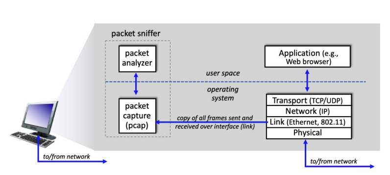
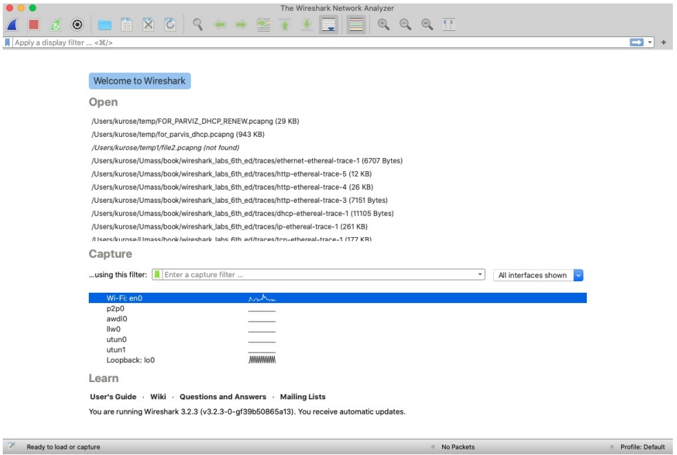
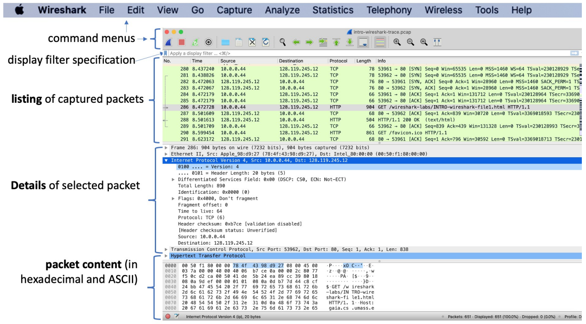
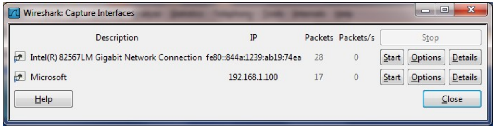
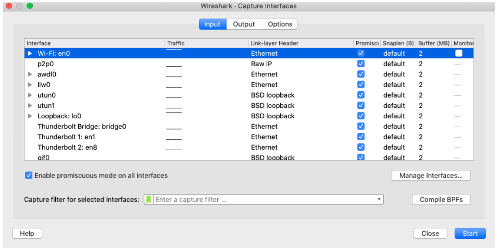
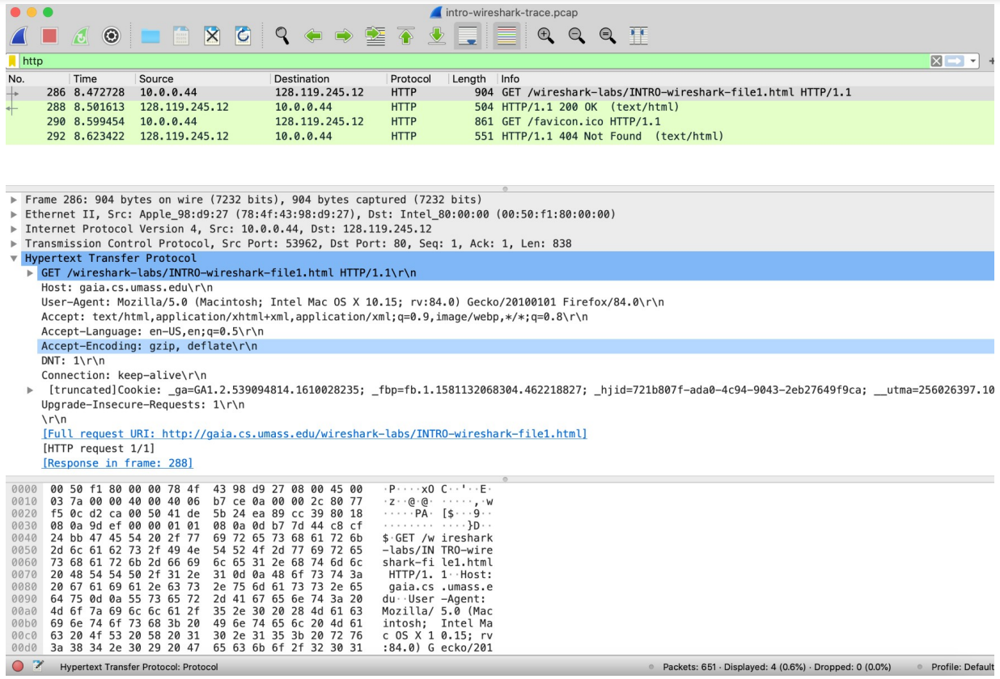

# Lab 0: Introdução

A compreensão dos protocolos de rede muitas vezes pode ser bastante aprofundada “ver protocolos em ação” e “brincar com protocolos” – observando a sequência de mensagens trocadas entre duas entidades de protocolo, aprofundando os detalhes da operação do protocolo e fazendo com que os protocolos realizar certas ações e, em seguida, observar essas ações e suas consequências. Isso pode ser feito em cenários simulados ou em um ambiente de rede “real” como a Internet. Nos laboratórios do Wireshark que você fará neste curso, você executará vários aplicativos de rede em diferentes cenários usando seu próprio computador. Você observará os protocolos de rede em seu computador “em ação”, interagindo e trocando mensagens com entidades de protocolo em execução em outros lugares da Internet. Assim, você e seu computador serão parte integrante desses laboratórios “ao vivo”. Você observará e aprenderá fazendo.

Neste primeiro lab, você se familiarizará com o Wireshark e fará algumas capturas e observações simples de pacotes.

## Entendendo a simulação

A ferramenta básica para observar as mensagens trocadas entre as entidades de protocolo em execução é chamada de **sniffer de pacotes**. Como o nome sugere, um _packet sniffer_ (farejador de pacotes) captura “sniffs” - mensagens enviadas/recebidas de/pelo seu computador; ele também normalmente armazenará e/ou exibirá o conteúdo dos vários campos de protocolo nessas mensagens capturadas. Um sniffer de pacotes em si é passivo. Ele observa as mensagens enviadas e recebidas por aplicativos e protocolos em execução no computador, mas nunca envia pacotes. Da mesma forma, os pacotes recebidos nunca são explicitamente endereçados ao sniffer de pacotes. Em vez disso, um packet sniffer recebe uma cópia dos pacotes que são enviados/recebidos de/pelo aplicativo e protocolos em execução em sua máquina.

A imagem a seguir mostra a estrutura de um sniffer de pacotes. À direita, estão os protocolos (neste caso, protocolos de Internet) e aplicativos (como um navegador da Web ou cliente de e-mail) que normalmente são executados em seu computador. O packet sniffer, mostrado dentro do retângulo tracejado, é uma adição ao software usual em seu computador e consiste em dois componentes: o primeiro é a **biblioteca de captura de pacotes**, que recebe uma cópia de cada quadro da camada de link que é enviado ou recebido pelo seu computador por uma determinada interface (camada de link, como Ethernet ou WiFi). Saiba que as mensagens trocadas por protocolos de camadas superiores, como HTTP, FTP, TCP, UDP, DNS ou IP, são eventualmente encapsuladas em quadros de camada de enlace que são transmitidos por meio físico como um cabo Ethernet ou um rádio WiFi 802.11. A captura de todos os quadros da camada de link fornece todas as mensagens enviadas/recebidas no link monitorado de/por todos os protocolos e aplicativos executados em seu computador.

O segundo componente de um sniffer de pacotes é o **analisador de pacotes**, que exibe o conteúdo de todos os campos dentro de uma mensagem de protocolo. Para isso, o analisador de pacotes deve “entender” a estrutura de todas as mensagens trocadas pelos protocolos. Por exemplo, suponha que estamos interessados em exibir os vários campos nas mensagens trocadas pelo protocolo HTTP na imagem anterior. O analisador de pacotes entende o formato dos quadros Ethernet e, portanto, pode identificar o datagrama IP dentro de um quadro Ethernet. Ele também entende o formato do datagrama IP, para que possa extrair o segmento TCP dentro do datagrama IP. Finalmente, ele entende a estrutura do segmento TCP, para que possa extrair a mensagem HTTP contida no segmento TCP. Finalmente, ele entende o protocolo HTTP e assim, por exemplo, sabe que os primeiros bytes de uma mensagem HTTP conterão a string “GET”, “POST” ou “HEAD”.

Usaremos o sniffer de pacotes Wireshark [http://www.wireshark.org/] para esses labs, permitindo exibir o conteúdo das mensagens enviadas/recebidas de/por protocolos em diferentes níveis da pilha de protocolos. Tecnicamente falando, o Wireshark é um analisador de pacotes que usa uma biblioteca de captura de pacotes em seu computador. frames, datagramas da camada de rede, segmentos da camada de transporte e mensagens da camada de aplicação, então usaremos o termo “pacote” menos preciso aqui para acompanhar a convenção do Wireshark. Wireshark é um analisador de protocolo de rede gratuito que roda em computadores Windows, Mac e Linux/Unix.

O Wireshark um analisador de pacotes ideal para nossos laboratórios – é estável, tem uma grande base de usuários e suporte bem documentado que inclui um guia do usuário (http://www.wireshark.org/docs/wsug_html_chunked/), páginas man (http://www.wireshark.org/docs/wsug_html_chunked/), (http://www.wireshark.org/docs/man-pages/) e um FAQ detalhado (http://www.wireshark.org/faq.html), rica funcionalidade que inclui a capacidade de analisar centenas de protocolos e uma interface de usuário. Ele opera em computadores usando LANs sem fio Ethernet, serial (PPP), 802.11 (WiFi) e muitas outras tecnologias de camada de link.

## Baixando o Wireshark

Para executar o Wireshark, você precisará ter acesso a um computador que suporte tanto o Wireshark quanto a biblioteca de captura de pacotes libpcap ou WinPCap. O software libpcap será instalado para você, se não estiver instalado em seu sistema operacional, quando você instalar o Wireshark. Consulte http://www.wireshark.org/download.html para obter uma lista de sistemas operacionais suportados e sites de download. 

Para baixar e instalar o software Wireshark, acesse http://www.wireshark.org/download.html, e em seguida baixe e instale o binário do Wireshark para seu computador. O FAQ do Wireshark tem várias dicas úteis e informações interessantes, especialmente se você tiver problemas para instalar ou executar o Wireshark.

## Executando o Wireshark 

Ao executar o programa Wireshark, você obterá uma tela de inicialização parecida com a tela abaixo. Diferentes versões do Wireshark terão diferentes telas de inicialização – então não entre em pânico se a sua não se parecer exatamente com a tela abaixo! A documentação do Wireshark afirma: “Como o Wireshark é executado em muitas plataformas diferentes com muitos gerenciadores de janelas diferentes, diferentes estilos aplicados e existem diferentes versões do kit de ferramentas GUI subjacente usado, sua tela pode parecer diferente das capturas de tela fornecidas. Mas como não há diferenças reais na funcionalidade, essas capturas de tela ainda devem ser bem compreensíveis.”

Não há muito que seja muito interessante nesta tela. Mas observe que, na seção Captura, há uma lista das chamadas interfaces. O computador Mac do qual estamos tirando essas capturas de tela tem apenas uma interface – “Wi-Fi en0” (sombreado em azul na imagem anterior), que é a interface para acesso Wi-Fi. Todos os pacotes de/para este computador passarão pela interface Wi-Fi, então é aqui que queremos capturar os pacotes. Em um Mac, clique duas vezes nesta interface (ou em outro computador localize a interface na página de inicialização através da qual você está obtendo conectividade com a Internet, por exemplo, provavelmente uma interface WiFi ou Ethernet e selecione essa interface).

Vamos dar uma volta no Wireshark! Se você clicar em uma dessas interfaces para iniciar a captura de pacotes (ou seja, para que o Wireshark comece a capturar todos os pacotes enviados de/para essa interface), uma tela como a abaixo será exibida, mostrando informações sobre os pacotes que estão sendo capturados. Depois de iniciar a captura de pacotes, você pode pará-la usando o menu suspenso Capturar e selecionando Parar (ou clicando no botão quadrado vermelho ao lado da aleta do Wireshark na imagem anterior).

Observe a imagem a seguir. A interface Wireshark tem cinco componentes principais:

- Os **menus de comando** são menus suspensos padrão localizados na parte superior da janela do Wireshark (e em um Mac na parte superior da tela também). De interesse para nós agora são os menus Arquivo e Captura. O menu Arquivo permite que você salve dados de pacotes capturados ou abra um arquivo contendo dados de pacotes capturados anteriormente e saia do aplicativo Wireshark. O menu Capturar permite iniciar a captura de pacotes.
- A janela de **listagem de pacotes** exibe um resumo de uma linha para cada pacote capturado, incluindo o número do pacote (atribuído pelo Wireshark; observe que este não é um número de pacote contido no cabeçalho de nenhum protocolo), a hora em que o pacote foi capturado, o endereços de origem e destino do pacote, o tipo de protocolo e as informações específicas do protocolo contidas no pacote. A listagem de pacotes pode ser classificada de acordo com qualquer uma dessas categorias clicando no nome de uma coluna. O campo tipo de protocolo lista o protocolo de nível mais alto que enviou ou recebeu esse pacote, ou seja, o protocolo que é a origem ou o destino final desse pacote.
- A janela de **detalhes do cabeçalho do pacote** fornece detalhes sobre o pacote selecionado (realçado) na janela de listagem de pacotes. (Para selecionar um pacote na janela de listagem de pacotes, coloque o cursor sobre o resumo de uma linha do pacote na janela de listagem de pacotes e clique com o botão esquerdo do mouse.). Esses detalhes incluem informações sobre o quadro Ethernet (assumindo que o pacote foi enviado/recebido por uma interface Ethernet) e datagrama IP que contém esse pacote. A quantidade de detalhes da camada Ethernet e IP exibida pode ser expandida ou minimizada clicando nas caixas mais/menos ou nos triângulos apontando para a direita/para baixo à esquerda do quadro Ethernet ou linha de datagrama IP na janela de detalhes do pacote. Se o pacote foi transportado por TCP ou UDP, os detalhes de TCP ou UDP também serão exibidos, que podem ser expandidos ou minimizados da mesma forma. Por fim, também são fornecidos detalhes sobre o protocolo de nível mais alto que enviou ou recebeu esse pacote.
- A janela de **conteúdo do pacote** exibe todo o conteúdo do quadro capturado, em formato ASCII e hexadecimal.
- Na parte superior da interface gráfica do usuário do Wireshark, está o **campo de filtro de exibição de pacotes**, no qual um nome de protocolo ou outras informações podem ser inseridas para filtrar as informações exibidas na janela de listagem de pacotes (e, portanto, o cabeçalho do pacote e o pacote -janelas de conteúdo). No exemplo abaixo, usaremos o campo de filtro de exibição de pacotes para que o Wireshark oculte (não exiba) pacotes, exceto aqueles que correspondem a mensagens HTTP.

## Primeiro teste com Wireshark

A melhor maneira de aprender sobre qualquer novo software é experimentá-lo! Vamos supor que seu computador esteja conectado à Internet por meio de uma interface Ethernet com fio ou uma interface WiFi 802.11 sem fio. Faça o seguinte:

1. Inicie seu navegador favorito, que exibirá a página inicial selecionada.
2. Inicie o software Wireshark. Você verá inicialmente uma janela semelhante à mostrada na Figura 2. O Wireshark ainda não começou a capturar pacotes.
3. Para iniciar a captura de pacotes, selecione o menu suspenso Capturar e selecione Interfaces. Isso fará com que a janela “Wireshark: Capture Interfaces” seja exibida (em um PC) ou você pode escolher Opções em um Mac. Você deverá ver uma lista de interfaces, conforme mostrado nas imagens a seguir.

4. Você verá uma lista das interfaces em seu computador, bem como uma contagem dos pacotes que foram observados nessa interface até agora. Em uma máquina Windows, clique em Iniciar para a interface na qual você deseja iniciar a captura de pacotes (no caso da imagem para o Windows, a Conexão de rede Gigabit). Em uma máquina Windows, selecione a interface e clique em Iniciar na parte inferior da janela). A captura de pacotes começará agora - o Wireshark agora está capturando todos os pacotes enviados/recebidos de/pelo seu computador!
5. Depois de iniciar a captura de pacotes, a interface inicial aparecerá. Esta janela mostra os pacotes que estão sendo capturados. Selecionando o menu suspenso Capturar e selecionando Parar, ou clicando no quadrado vermelho Parar, você pode interromper a captura de pacotes. Mas não pare a captura de pacotes ainda. Vamos capturar alguns pacotes interessantes primeiro. Para fazer isso, precisaremos gerar algum tráfego de rede. Vamos fazer isso usando um navegador da web, que usará o protocolo HTTP que estudaremos detalhadamente em aula para baixar o conteúdo de um site.
6. Enquanto o Wireshark estiver rodando, digite a URL: http://gaia.cs.umass.edu/wireshark-labs/INTRO-wireshark-file1.html e tenha essa página exibida em seu navegador. Para exibir esta página, seu navegador entrará em contato com o servidor HTTP em gaia.cs.umass.edu e trocará mensagens HTTP com o servidor para fazer o download desta página. Os quadros Ethernet ou WiFi contendo essas mensagens HTTP (assim como todos os outros quadros que passam pelo seu adaptador Ethernet ou WiFi) serão capturados pelo Wireshark.
7. Depois que seu navegador exibir a página INTRO-wireshark-file1.html (é uma simples linha de parabéns), interrompa a captura de pacotes do Wireshark selecionando parar na janela de captura do Wireshark. A janela principal do Wireshark agora deve ser semelhante à imagem da interface inicial. Agora você tem dados de pacote ao vivo que contêm todas as mensagens de protocolo trocadas entre seu computador e outras entidades de rede! As trocas de mensagens HTTP com o servidor web gaia.cs.umass.edu devem aparecer em algum lugar na lista de pacotes capturados. Mas haverá muitos outros tipos de pacotes exibidos também (veja, por exemplo, os vários tipos de protocolos diferentes mostrados na coluna Protocolo). Mesmo que a única ação que você tenha feito tenha sido baixar uma página da web, evidentemente havia muitos outros protocolos em execução em seu computador que não eram vistos pelo usuário. Aprenderemos muito mais sobre esses protocolos à medida que progredirmos no texto! Por enquanto, você deve estar ciente de que muitas vezes há muito mais acontecendo do que “encontrar os olhos”!
8. Digite “http” (sem as aspas e em minúsculas – todos os nomes de protocolo estão em minúsculas no Wireshark, e certifique-se de pressionar a tecla enter/return) na janela de especificação do filtro de exibição na parte superior da janela principal do Wireshark . Em seguida, selecione Aplicar (à direita de onde você digitou “http”) ou apenas pressione retornar. Isso fará com que apenas a mensagem HTTP seja exibida na janela de listagem de pacotes. A próxima imagem mostra uma captura de tela depois que o filtro http foi aplicado à janela de captura de pacote mostrada anteriormente na imagem da interface. Observe também que na janela Detalhes do pacote selecionado, optamos por mostrar o conteúdo detalhado da mensagem do aplicativo Hypertext Transfer Protocol que foi encontrada no segmento TCP, que estava dentro do datagrama IPv4 que estava dentro do quadro Ethernet II (WiFi). Concentrar-se no conteúdo em uma mensagem, segmento, datagrama e nível de quadro específico nos permite focar apenas no que queremos ver (neste caso, mensagens HTTP).

9. Encontre a mensagem HTTP GET que foi enviada do seu computador para o servidor HTTP gaia.cs.umass.edu. (Procure uma mensagem HTTP GET na parte “listing of captured packets” da janela do Wireshark que mostra “GET” seguido pela URL gaia.cs.umass.edu que você digitou. frame, datagrama IP, segmento TCP e informações de cabeçalho de mensagem HTTP serão exibidas na janela de cabeçalho de pacote. Ao clicar em '+' e '-' e setas apontando para a direita e para baixo para o lado esquerdo da janela de detalhes do pacote, minimize a quantidade de informações de Frame, Ethernet, Internet Protocol e Transmission Control Protocol exibida. de informações de protocolo para todos os protocolos, exceto HTTP, e a quantidade maximizada de informações de protocolo para HTTP na janela de cabeçalho do pacote).
10. Saia do programa Wireshark.

É isso aí! Completamos nosso primeiro lab.

## Projeto prático 1

1. Quais dos seguintes protocolos são mostrados como aparecendo (ou seja, estão listados na coluna “protocolo” do Wireshark) em seu arquivo de rastreamento: TCP, QUIC, HTTP, DNS, UDP, TLSv1.2?
2. Quanto tempo levou desde o envio da mensagem HTTP GET até o recebimento da resposta HTTP OK? (Por padrão, o valor da coluna Time na janela de listagem de pacotes é a quantidade de tempo, em segundos, desde que o rastreamento do Wireshark começou. menu para baixo, selecione Formato de exibição de hora e selecione Hora do dia.)
3. Qual é o endereço de Internet do gaia.cs.umass.edu (também conhecido como www-net.cs.umass.edu)? Qual é o endereço de Internet do seu computador ou (se você estiver usando o arquivo de rastreamento) do computador que enviou a mensagem HTTP GET?

Para responder às duas perguntas a seguir, você precisará selecionar o pacote TCP que contém a solicitação HTTP GET (dica: este é o pacote número 286). O objetivo dessas duas próximas perguntas é familiarizá-lo com o uso dos “Detalhes da janela do pacote selecionado” do Wireshark; veja a imagem da interface para fazer isso, clicando em Packet 286 (sua tela deve ser parecida com a imagem da interface). Para responder a primeira pergunta abaixo, então olhe na janela “Detalhes do pacote selecionado” e alterne o triângulo para HTTP (sua tela deve ficar parecida com a imagem de detalhes); para a segunda pergunta abaixo, você precisará expandir as informações na parte TCP (Transmission Control Protocol) deste pacote.

4. Expanda as informações sobre a mensagem HTTP na janela "Detalhes do pacote selecionado" do Wireshark (veja a Figura 3 acima) para que você possa ver os campos na mensagem de solicitação HTTP GET. Que tipo de navegador da Web emitiu a solicitação HTTP? A resposta é mostrada na extremidade direita das informações após o campo “User-Agent:” na tela de mensagem HTTP expandida. (Este valor de campo na mensagem HTTP é como um servidor web aprende que tipo de navegador você está usando: Firefox, Safari, Microsoft Internet Edge, Outros).
5. Expanda as informações sobre o Transmission Control Protocol para este pacote na janela "Detalhes do pacote selecionado" do Wireshark para que você possa ver os campos no segmento TCP que transportam a mensagem HTTP. Qual é o número da porta de destino (o número após “Dest Port:” para o segmento TCP que contém a solicitação HTTP) para a qual esta solicitação HTTP está sendo enviada?
6. Imprima as duas mensagens HTTP (GET e OK) referidas na questão 2 acima. Para fazer isso, selecione Imprimir no menu de comando Arquivo Wireshark e selecione os botões radiais “Somente pacote selecionado” e “Imprimir conforme exibido” e clique em OK.

