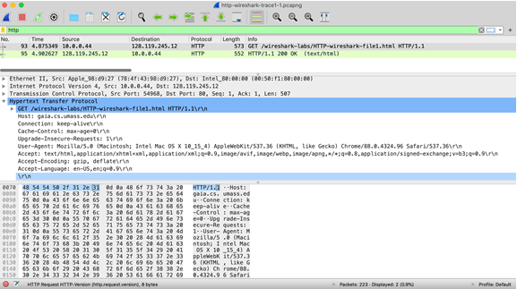

# Lab 1: HTTP

Tendo molhado os pés com o sniffer de pacotes Wireshark no laboratório introdutório, estamos prontos para usar o Wireshark para investigar protocolos em operação. Neste laboratório, exploraremos vários aspectos do protocolo HTTP: a interação GET/resposta básica, formatos de mensagem HTTP, recuperação de arquivos HTML grandes, recuperação de arquivos HTML com objetos incorporados e autenticação e segurança HTTP.

## A interação GET/response básica

Vamos começar nossa exploração de HTTP baixando um arquivo HTML muito simples - um que é muito curto e não contém objetos incorporados.

Faça o seguinte:

1. Inicie seu navegador da web.
2. Inicie o Wireshark, conforme descrito no laboratório introdutório (mas ainda não inicie a captura de pacotes). Digite “http” (apenas as letras, não as aspas e em minúsculas) na janela de especificação do filtro de exibição, para que apenas as mensagens HTTP capturadas sejam exibidas posteriormente na janela de listagem de pacotes. (Estamos interessados apenas no protocolo HTTP aqui e não queremos ver a confusão de todos os pacotes capturados).
3. Aguarde um pouco mais de um minuto (veremos o porquê em breve) e, em seguida, inicie a captura de pacotes do Wireshark.
4. Digite o seguinte no seu navegador
<http://gaia.cs.umass.edu/wireshark-labs/HTTP-wireshark-file1.html>
Seu navegador deve exibir o arquivo HTML muito simples de uma linha.
5. Pare a captura de pacotes do Wireshark.

Sua janela do Wireshark deve ser semelhante à janela mostrada na Figura 1. Se você não conseguir executar o Wireshark em uma conexão de rede ativa, você pode baixar um rastreamento de pacote que foi criado quando as etapas acima foram seguidas. [^1]

O exemplo na Figura 1 mostra na janela de listagem de pacotes que duas mensagens HTTP foram capturadas: a mensagem GET (do seu navegador para o servidor web gaia.cs.umass.edu) e a mensagem de resposta do servidor para o seu navegador. A janela de conteúdo do pacote mostra detalhes da mensagem selecionada (neste caso, a mensagem HTTP OK, que é destacada na janela de listagem de pacotes). Lembre-se de que, como a mensagem HTTP foi transportada dentro de um segmento TCP, que foi transportado dentro de um datagrama IP, que foi transportado dentro de um quadro Ethernet, o Wireshark também exibe as informações do pacote Frame, Ethernet, IP e TCP. Queremos minimizar a quantidade de dados não HTTP exibidos (estamos interessados ​​em HTTP aqui e investigaremos esses outros protocolos em laboratórios posteriores), portanto, certifique-se de que as caixas na extremidade esquerda de Frame, Ethernet, IP e As informações TCP têm um sinal de mais ou um triângulo apontando para a direita (o que significa que há informações ocultas e não exibidas) e a linha HTTP tem um sinal de menos ou um triângulo apontando para baixo (o que significa que todas as informações sobre a mensagem HTTP são exibidas).

[^1]: Você pode baixar o arquivo zip <http://gaia.cs.umass.edu/wireshark-labs/wireshark-traces-8.1.zip> e extrair o arquivo de rastreamento http-wireshark-trace1-1. Esses arquivos de rastreamento podem ser usados ​​para responder a essas perguntas do laboratório do Wireshark sem realmente capturar pacotes por conta própria. Cada rastreamento foi feito usando o Wireshark rodando em um dos computadores do autor, enquanto realizava as etapas indicadas no laboratório do Wireshark. Depois de baixar um arquivo de rastreamento, você pode carregá-lo no Wireshark e visualizar o rastreamento usando o menu suspenso Arquivo, escolhendo Abrir e selecionando o nome do arquivo de rastreamento. A exibição resultante deve ser semelhante à Figura 1 (para o arquivo de rastreamento http-wireshark-trace1-1 para este laboratório HTTP). A interface do usuário do Wireshark é exibida de forma um pouco diferente em diferentes sistemas operacionais e em diferentes versões do Wireshark. (Nota: Você deve ignorar qualquer HTTP GET e resposta para favicon.ico. Se você vir uma referência a este arquivo, é o seu navegador automaticamente perguntando ao servidor se ele (o servidor) tem um pequeno arquivo de ícone que deve ser exibido ao lado de o URL exibido em seu navegador. Ignoraremos as referências a esse arquivo incômodo neste laboratório).

Observando as informações nas mensagens HTTP GET e de resposta, responda às perguntas a seguir.

1. Seu navegador está executando HTTP versão 1.0, 1.1 ou 2? Qual versão do HTTP o servidor está executando?
2. Quais idiomas (se houver) seu navegador indica que pode aceitar no servidor?
3. Qual é o endereço IP do seu computador? Qual é o endereço IP do servidor gaia.cs.umass.edu?
4. Qual é o código de status retornado do servidor para o seu navegador?
5. Quando o arquivo HTML que você está recuperando foi modificado pela última vez no servidor?
6. Quantos bytes de conteúdo estão sendo retornados ao seu navegador?
7. Ao inspecionar os dados brutos na janela de conteúdo do pacote, você vê algum cabeçalho nos dados que não é exibido na janela de listagem de pacotes? Se sim, cite um.

Em sua resposta à pergunta 5 acima (supondo que você esteja executando o Wireshark “ao vivo”, em vez de usar um arquivo de rastreamento gravado anteriormente), você pode ter ficado surpreso ao descobrir que o documento que você acabou de recuperar foi modificado pela última vez um minuto antes você baixou o documento. Isso porque (para este arquivo em particular), o servidor gaia.cs.umass.edu está definindo a hora da última modificação do arquivo como a hora atual, e está fazendo isso uma vez por minuto. Assim, se você esperar um minuto entre os acessos, o arquivo parecerá ter sido modificado recentemente e, portanto, seu navegador fará o download de uma “nova” cópia do documento.

## A interação HTTP condicional GET/response

A maioria dos navegadores da Web executa cache de objetos e, portanto, geralmente executa um GET condicional ao recuperar um objeto HTTP. Antes de executar as etapas abaixo, verifique se o cache do seu navegador está vazio[^2]. Agora faça o seguinte:

- Inicie seu navegador da web e certifique-se de que o cache do seu navegador esteja limpo, conforme discutido acima.
- Inicie o Wireshark
- Digite o seguinte URL no seu navegador
<http://gaia.cs.umass.edu/wireshark-labs/HTTP-wireshark-file2.html>
Seu navegador deve exibir um arquivo HTML de cinco linhas muito simples.
- Insira rapidamente o mesmo URL em seu navegador novamente (ou simplesmente selecione o botão atualizar no seu navegador)
- Pare a captura de pacotes do Wireshark e digite “http” (novamente, em letras minúsculas sem as aspas) na janela de especificação do filtro de exibição, para que apenas as mensagens HTTP capturadas sejam exibidas posteriormente na janela de listagem de pacotes.

[^2]: Consulte <https://www.howtogeek.com/304218/how-to-clear-your-history-in-any-browser/> para obter instruções sobre como limpar o cache do navegador.

Se você não conseguir executar o Wireshark em uma conexão de rede ativa (ou não conseguir que seu navegador emita um campo If-Modified-Since na segunda solicitação HTTP GET), você pode baixar um rastreamento de pacote que foi criado quando as etapas acima foram seguidos. Responda as seguintes questões[^3]:

8. Inspecione o conteúdo da primeira solicitação HTTP GET do seu navegador para o servidor. Você vê uma linha “IF-MODIFIED-SINCE” no HTTP GET?
9. Inspecione o conteúdo da resposta do servidor. O servidor retornou explicitamente o conteúdo do arquivo? Como você sabe?
10. Agora inspecione o conteúdo da segunda solicitação HTTP GET do seu navegador para o servidor. Você vê uma linha “IF-MODIFIED-SINCE:” no HTTP GET[^4]? Em caso afirmativo, quais informações seguem o cabeçalho “IF-MODIFIED-SINCE:”?
11. Qual é o código de status HTTP e a frase retornada do servidor em resposta a este segundo HTTP GET? O servidor retornou explicitamente o conteúdo do arquivo? Explique.

## Recuperando Documentos Longos

Em nossos exemplos até agora, os documentos recuperados foram arquivos HTML simples e curtos. Vamos ver o que acontece quando baixamos um arquivo HTML longo. Faça o seguinte:

- Inicie seu navegador da Web e certifique-se de que o cache do seu navegador esteja limpo, conforme discutido acima.
- Inicie o  Wireshark
- Digite o seguinte URL em seu navegador
<http://gaia.cs.umass.edu/wireshark-labs/HTTP-wireshark-file3.html>
Seu navegador deve exibir a bastante longa Declaração de Direitos dos EUA.
- Pare a captura de pacotes do Wireshark e digite “http” na janela de especificação do filtro de exibição, para que apenas as mensagens HTTP capturadas sejam exibidas.

[^3]: Se você não conseguir executar o Wireshark em uma conexão de rede ativa, você pode baixar o arquivo zip <http://gaia.cs.umass.edu/wireshark-labs/wireshark-traces-8.1.zip> e extrair o arquivo de rastreamento http-wireshark-trace2-1.

[^4]: Dica: idealmente, você deve ver um cabeçalho If-Modified-Since, já que acabou de baixar esta página alguns segundos atrás. No entanto, dependendo do navegador que você está usando e do formato da resposta anterior do servidor ao seu GET inicial, seu navegador pode não incluir um If-Modified-Since, mesmo que o documento tenha sido baixado e armazenado em cache. O navegador Chrome é muito bom em usar regularmente If-Modified-Since. Mas o Safari e o Firefox são muito mais exigentes sobre quando usar If-Modified-Since. A vida nem sempre é tão fácil na prática quanto na teoria!

Na janela de listagem de pacotes, você deve ver sua mensagem HTTP GET, seguida por uma resposta TCP de vários pacotes à sua solicitação HTTP GET. Certifique-se de que o filtro de exibição do Wireshark esteja limpo para que a resposta TCP de vários pacotes seja exibida na lista de pacotes.

Essa resposta de vários pacotes merece um pouco de explicação. Lembre-se de que a mensagem de resposta HTTP consiste em uma linha de status, seguida por linhas de cabeçalho, seguida por uma linha em branco, seguida pelo corpo da entidade. No caso do nosso HTTP GET, o corpo da entidade na resposta é todo o arquivo HTML solicitado. No nosso caso aqui, o arquivo HTML é bastante longo e com 4500 bytes é muito grande para caber em um pacote TCP. A única mensagem de resposta HTTP é, portanto, dividida em várias partes pelo TCP, com cada parte contida em um segmento TCP separado. Nas versões recentes do Wireshark, o Wireshark indica cada segmento TCP como um pacote separado, e o fato de que a única resposta HTTP foi fragmentada em vários pacotes TCP é indicado pelo “segmento TCP de uma PDU remontada” na coluna Info da tela do Wireshark.

Responda as seguintes perguntas[^5]:

12. Quantas mensagens de solicitação HTTP GET seu navegador enviou? Qual número de pacote no rastreamento contém a mensagem GET para o Bill ou Rights?
13. Qual número de pacote no rastreamento contém o código de status e a frase associada à resposta à solicitação HTTP GET?
14. Qual é o código de status e a frase na resposta?
15. Quantos segmentos TCP contendo dados foram necessários para transportar a única resposta HTTP e o texto da Declaração de Direitos?

[^5]: Se você não conseguir executar o Wireshark em uma conexão de rede ativa, você pode baixar o arquivo zip <http://gaia.cs.umass.edu/wireshark-labs/wireshark-traces-8.1.zip> e extrair o arquivo de rastreamento http-wireshark-trace3-1.

## Documentos HTML com objetos incorporados

Agora que vimos como o Wireshark exibe o tráfego de pacotes capturados para arquivos HTML grandes, podemos ver o que acontece quando seu navegador baixa um arquivo com objetos incorporados, ou seja, um arquivo que inclui outros objetos (no exemplo abaixo, arquivos de imagem ) que estão armazenados em outro(s) servidor(es).

Faça o seguinte:

- Inicie seu navegador da web e certifique-se de que o cache do seu navegador esteja limpo, conforme discutido acima.
- Inicie o Wireshark
- Digite o seguinte URL no seu navegador <http://gaia.cs.umass.edu/wireshark-labs/HTTP-wireshark-file4.html>

Seu navegador deve exibir um arquivo HTML curto com duas imagens. Essas duas imagens são referenciadas no arquivo HTML base. Ou seja, as próprias imagens não estão contidas no HTML; em vez disso, os URLs das imagens estão contidos no arquivo HTML baixado. Conforme discutido no livro, seu navegador terá que recuperar esses logotipos dos sites indicados. O logotipo do nosso editor é obtido do site gaia.cs.umass.edu. A imagem da capa da 8ª edição do livro de abordagem top-down (uma de nossas capas favoritas) está armazenada em um servidor na França.

- Pare a captura de pacotes do Wireshark e digite “http” na janela de especificação do filtro de exibição, para que apenas as mensagens HTTP capturadas sejam exibidas.

Responda as seguintes questões[^6]:
16. Quantas mensagens de solicitação HTTP GET seu navegador enviou? Para quais endereços da Internet essas solicitações GET foram enviadas?
17. Você pode dizer se o seu navegador baixou as duas imagens em série ou se elas foram baixadas dos dois sites em paralelo? Explique.

[^6]: Se você não conseguir executar o Wireshark em uma conexão de rede ativa, você pode baixar o arquivo zip <http://gaia.cs.umass.edu/wireshark-labs/wireshark-traces-8.1.zip> e extrair o arquivo de rastreamento http-wireshark-trace4-1.

## Autenticação HTTP

Por fim, vamos tentar visitar um site protegido por senha e examinar a sequência de mensagens HTTP trocadas por esse site. O URL
<http://gaia.cs.umass.edu/wireshark-labs/protected_pages/HTTP-wireshark-file5.html> é protegido por senha. O nome de usuário é “wireshark-students” (sem as aspas), e a senha é “network” (novamente, sem as aspas). Então, vamos acessar este site protegido por senha “seguro”. Faça o seguinte:

- Certifique-se de que o cache do seu navegador esteja limpo, conforme discutido acima, e feche o navegador. Em seguida, inicie seu navegador
- Inicie o sniffer de pacotes Wireshark
- Digite o seguinte URL no seu navegador
<http://gaia.cs.umass.edu/wireshark-labs/protected_pages/HTTP-wireshark-file5.html>
Digite o nome de usuário e a senha solicitados na caixa pop-up.
- Pare a captura de pacotes do Wireshark e digite “http” na janela de especificação do filtro de exibição, para que apenas as mensagens HTTP capturadas sejam exibidas posteriormente na janela de listagem de pacotes.
- Nota: Se você não conseguir executar o Wireshark em uma conexão de rede ativa, você pode usar o rastreamento de pacote "clássico" http-ethereal-trace-5, ou outros rastreamentos adicionais, como notas na nota de rodapé 1, para responder às perguntas abaixo.

Agora vamos examinar a saída do Wireshark. Você pode querer primeiro ler sobre autenticação HTTP revisando o material fácil de ler sobre “HTTP Access Authentication Framework” em <http://frontier.userland.com/stories/storyReader$2159> .

Responda as seguintes perguntas[^7]:

18. Qual é a resposta do servidor (código de status e frase) em resposta à mensagem HTTP GET inicial do seu navegador?
19. Quando o seu navegador envia a mensagem HTTP GET pela segunda vez, qual novo campo é incluído na mensagem HTTP GET?

[^7]: Se você não conseguir executar o Wireshark em uma conexão de rede ativa, você pode baixar o arquivo zip <http://gaia.cs.umass.edu/wireshark-labs/wireshark-traces-8.1.zip> e extrair o arquivo de rastreamento http-wireshark-trace5-1.

O nome de usuário (wireshark-students) e a senha (network) que você digitou são codificados na sequência de caracteres (d2lyZXNoYXJrLXN0dWRlbnRzOm5ldHdvcms=) seguindo o cabeçalho “Authorization: Basic” na mensagem HTTP GET do cliente. Embora possa parecer que seu nome de usuário e senha estão criptografados, eles são simplesmente codificados em um formato conhecido como formato Base64. O nome de usuário e a senha não são criptografados! Para ver isso, vá para <http://www.motobit.com/util/base64-decoder-encoder.asp> e insira a string codificada em base64 d2lyZXNoYXJrLXN0dWRlbnRz e decodifique. Voilá! Você traduziu da codificação Base64 para a codificação ASCII e, portanto, deve ver seu nome de usuário! Para visualizar a senha, digite o restante da string Om5ldHdvcms= e pressione decode. Uma vez que qualquer um pode baixar uma ferramenta como o Wireshark e farejar pacotes (não apenas os seus próprios) passando por seu adaptador de rede, e qualquer um pode traduzir de Base64 para ASCII (você acabou de fazer isso!), deve ficar claro para você que senhas simples na WWW sites não são seguros a menos que medidas adicionais sejam tomadas.
