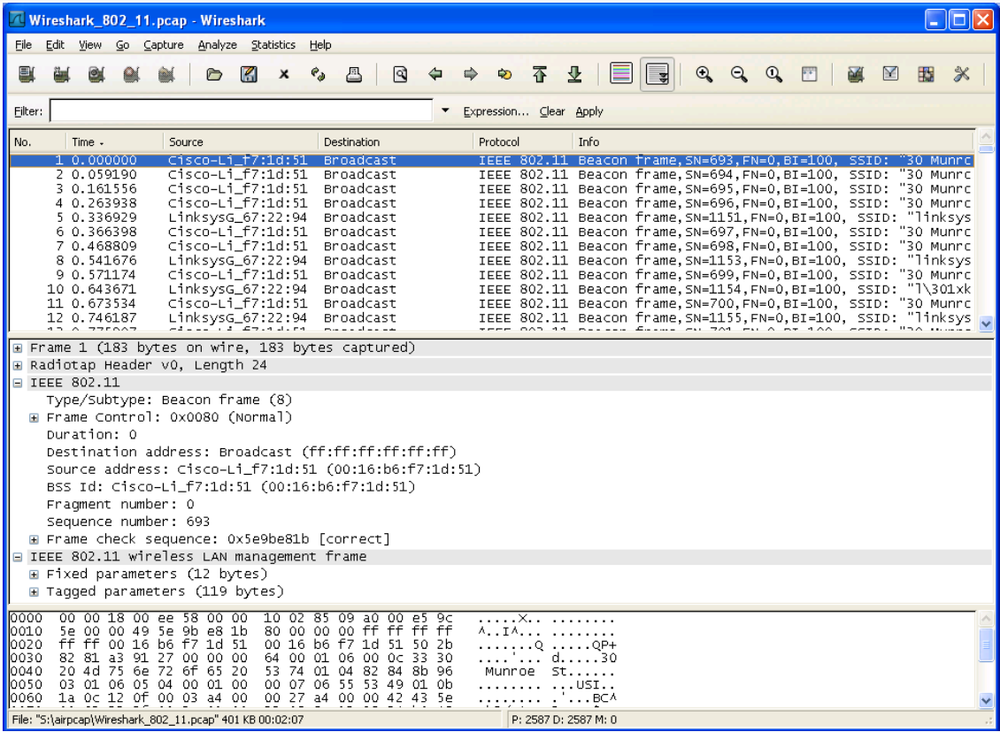

# Lab 10

Neste laboratório, exploraremos o protocolo de rede Wireless 802.11. 

Em todos os laboratórios do Wireshark até agora, capturamos quadros em uma conexão Ethernet com fio. Aqui, como 802.11 é um protocolo de camada de enlace sem fio, estaremos capturando quadros “no ar”. Infelizmente, alguns drivers de dispositivo para NICs 802.11 sem fio ainda não fornecem os ganchos para capturar/copiar quadros 802.11 recebidos para uso no Wireshark. 

Assim, neste laboratório, forneceremos um rastreamento de quadros 802.11 capturados para você analisar e assumir nas perguntas abaixo que você está usando esse rastreamento. Se você conseguir capturar quadros 802.11 usando sua versão do Wireshark, fique à vontade para fazê-lo.

## Introdução

Baixe o arquivo zip <http://gaia.cs.umass.edu/wireshark-labs/wireshark-traces.zip> e extraia o arquivo Wireshark_802_11.pcap. Este rastreamento foi coletado usando AirPcap e Wireshark rodando em um computador na rede doméstica de um dos autores, consistindo em um ponto de acesso/roteador Linksys 802.11g combinado, com dois PCs com fio e um PC host sem fio conectado ao ponto de acesso/roteador. Neste arquivo de rastreamento, veremos os quadros capturados no canal 6. 

Como o host e o AP em que estamos interessados não são os únicos dispositivos usando o canal 6, veremos muitos quadros nos quais não estamos interessados neste laboratório, como os quadros de sinalização anunciados pelo AP de um vizinho também operando em canal 6. As atividades do host sem fio tomadas no arquivo de rastreamento são:

- O host já está associado ao 30 Munroe St AP quando o rastreamento começa.
- Em t = 24,82, o host faz uma solicitação HTTP para http://gaia.cs.umass.edu/wireshark-labs/alice.txt. O endereço IP de gaia.cs.umass.edu é 128.119.245.12. 
- Em t=32.82, o host faz uma solicitação HTTP para http://www.cs.umass.edu, cujo endereço IP é 128.119.240.19. 
- Em t = 49,58, o host se desconecta do 30 Munroe St AP e tenta se conectar ao linksys_ses_24086. Este não é um ponto de acesso aberto e, portanto, o host eventualmente não consegue se conectar a este AP. 
- Em t=63,0, o host desiste de tentar associar-se ao AP linksys_ses_24086 e associa-se novamente ao ponto de acesso 30 Munroe St.

Depois de baixar o rastreamento, você pode carregá-lo no Wireshark e visualizar o rastreamento usando o menu suspenso Arquivo, escolhendo Abrir e, em seguida, selecionando o arquivo de rastreamento Wireshark_802_11.pcap. A exibição resultante deve se parecer com a figura a seguir:

## Quadros de Sinalização (Beacon Frames)

Lembre-se de que os quadros de sinalização são usados por um AP 802.11 para anunciar sua existência. Para responder a algumas das perguntas abaixo, você deve observar os detalhes do quadro “IEEE 802.11” e subcampos na janela central do Wireshark. Sempre que possível, ao responder a uma pergunta abaixo, você deve entregar uma impressão do(s) pacote(s) dentro do traço que você usou para responder à pergunta feita. Anote a impressão2 para explicar sua resposta. Para imprimir um pacote, use Arquivo->Imprimir, escolha Somente pacote selecionado, escolha Linha de resumo do pacote e selecione a quantidade mínima de detalhes do pacote que você precisa para responder à pergunta.

1. Quais são os SSIDs dos dois pontos de acesso que estão emitindo a maioria dos quadros de sinalização neste rastreamento? 
2. Quais são os intervalos de tempo entre as transmissões dos quadros de sinalização do ponto de acesso linksys_ses_24086? Do ponto de acesso 30 Munroe St.? (Dica: este intervalo de tempo está contido no próprio quadro de sinalização). 
3. Qual é (em notação hexadecimal) o endereço MAC de origem no quadro de sinalização de 30 Munroe St? Lembre-se da Figura 7.13 no texto que a origem, o destino e o BSS são três endereços usados em um quadro 802.11. Para uma discussão detalhada da estrutura do quadro 802.11, consulte a seção 7 no documento de padrões IEEE 802.11 (citado acima). 
4. Qual é (em notação hexadecimal) o endereço MAC de destino no quadro de sinalização de 30 Munroe St?? 
5. Qual é (em notação hexadecimal) o ID MAC BSS no quadro de sinalização de 30 Munroe St? 
6. Os quadros de sinalização do ponto de acesso 30 Munroe St anunciam que o ponto de acesso pode suportar quatro taxas de dados e oito “taxas estendidas suportadas” adicionais. Quais são essas taxas?

## Transferência de dados

Como o rastreamento começa com o host já associado ao AP, primeiro observe a transferência de dados em uma associação 802.11 antes de examinar a associação/desassociação do AP. Lembre-se de que nesse rastreamento, em t = 24,82, o host faz uma solicitação HTTP para http://gaia.cs.umass.edu/wireshark-labs/alice.txt. O endereço IP de gaia.cs.umass.edu é 128.119.245.12. Em seguida, em t=32,82, o host faz uma solicitação HTTP para http://www.cs.umass.edu.

7. Encontre o quadro 802.11 contendo o segmento SYN TCP para esta primeira sessão TCP (que baixa alice.txt). Quais são os três campos de endereço MAC no quadro 802.11? Qual endereço MAC neste quadro corresponde ao host sem fio (forneça a representação hexadecimal do endereço MAC do host)? Para o ponto de acesso? Para o roteador de primeiro salto? Qual é o endereço IP do host sem fio que está enviando este segmento TCP? Qual é o endereço IP de destino? Este endereço IP de destino corresponde ao host, ponto de acesso, roteador de primeiro salto ou algum outro dispositivo conectado à rede? Explique.
8. Encontre o quadro 802.11 que contém o segmento SYNACK para esta sessão TCP. Quais são os três campos de endereço MAC no quadro 802.11? Qual endereço MAC neste quadro corresponde ao host? Para o ponto de acesso? Para o roteador de primeiro salto? O endereço MAC do remetente no quadro corresponde ao endereço IP do dispositivo que enviou o segmento TCP encapsulado nesse datagrama? 

## Associação/Dissociação

Um host deve primeiro se associar a um ponto de acesso antes de enviar dados. A associação em 802.11 é realizada usando o quadro ASSOCIATE REQUEST (enviado do host para o AP, com quadro tipo 0 e subtipo 0) e o quadro ASSOCIATE RESPONSE (enviado pelo AP para um host com quadro tipo 0 e subtipo 1, em resposta a um PEDIDO DE ASSOCIADO recebido). Para obter uma explicação detalhada de cada campo no quadro 802.11, consulte a página 34 (Seção 7) da especificação 802.11 em <http://gaia.cs.umass.edu/wireshark-labs/802.11-1999.pdf>.

9. Quais são as duas ações tomadas (ou seja, quadros são enviados) pelo host no rastreamento logo após t=49, para encerrar a associação com o 30 Munroe St AP que estava inicialmente em vigor quando a coleta de rastreamento começou? (Dica: uma é uma ação da camada IP e a outra é uma ação da camada 802.11). Olhando para a especificação 802.11, há outro quadro que você esperava ver, mas não vê aqui?
10. Examine o arquivo de rastreamento e procure quadros AUTHENICATION enviados do host para um AP e vice-versa. Quantas mensagens de AUTHENICATION são enviadas do host sem fio para o AP linksys_ses_24086 (que tem um endereço MAC Cisco_Li_f5:ba:bb) começando por volta de t=49? .
11. O host deseja que a autenticação exija uma chave ou seja aberta
12. Você vê uma resposta AUTHENTICATION do AP linksys_ses_24086 no rastreamento?
13. Agora vamos considerar o que acontece quando o host desiste de tentar associar-se ao AP linksys_ses_24086 e agora tenta associar-se ao AP 30 Munroe St. Procure os quadros AUTHENICATION enviados do host para o AP e vice-versa. Em que momentos há um quadro de AUTHENICATION do host para o AP 30 Munroe St. e quando há uma AUTHENICATION de resposta enviada desse AP para o host em resposta? (Observe que você pode usar a expressão de filtro “wlan.fc.subtype == 11and wlan.fc.type == 0 and wlan.addr == IntelCor_d1:b6:4f” para exibir apenas os quadros de AUTHENICATION neste rastreamento para este host wireless.)
14. Um ASSOCIATE REQUEST do host para o AP e um quadro ASSOCIATE RESPONSE correspondente do AP para o host são usados para o host ser associado a um AP. A que horas há uma SOLICITAÇÃO DE ASSOCIADO do host para o 30 Munroe St AP? Quando é enviada a RESPOSTA ASSOCIADA correspondente? (Observe que você pode usar a expressão de filtro “wlan.fc.subtype < 2 e wlan.fc.type == 0 e wlan.addr == IntelCor_d1:b6:4f” para exibir apenas os frames ASSOCIATE REQUEST e ASSOCIATE RESPONSE para este vestígio.)
15. Quais taxas de transmissão o host está disposto a usar? O PA? Para responder a essa pergunta, você precisará examinar os campos de parâmetros do quadro de gerenciamento de LAN sem fio 802.11.

## Outros tipos de quadro

Nosso rastreamento contém vários quadros PROBE REQUEST e PROBE RESPONSE.

16. Quais são os endereços MAC do remetente, destinatário e BSS ID nesses quadros? Qual é o objetivo desses dois tipos de quadros? (Para responder a esta última pergunta, você precisará pesquisar as referências on-line citadas anteriormente neste laboratório).