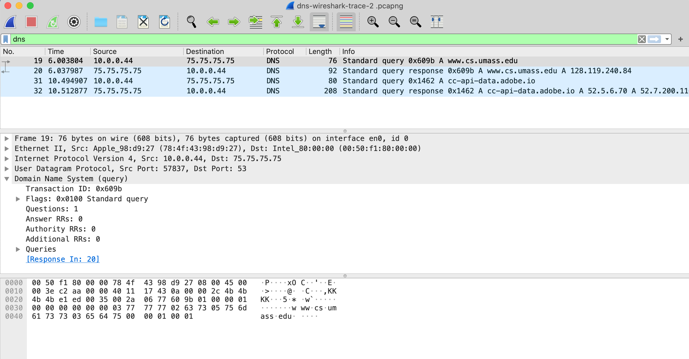

# Lab 2: DNS

O Domain Name System (DNS) traduz nomes de host em endereços IP, cumprindo um papel crítico na infraestrutura da Internet. Neste laboratório, veremos mais de perto o lado cliente do DNS. Lembre-se de que a função do cliente no DNS é relativamente simples – um cliente envia uma consulta para seu servidor DNS local e recebe uma resposta de volta. Muito pode acontecer “nos bastidores”, invisível para um cliente DNS, pois os servidores DNS hierárquicos se comunicam entre si para resolver recursiva ou iterativamente a consulta DNS do cliente. Do ponto de vista do cliente DNS, no entanto, o protocolo é bastante simples – uma consulta é formulada para o servidor DNS local e uma resposta é recebida desse servidor.

Antes de iniciar este laboratório, você deseja revisar os tópicos de DNS sobre, em particular, o material sobre servidores DNS locais, cache de DNS, registros e mensagens de DNS e o campo TYPE no registro de DNS.

## `nslookup`

Vamos começar nossa investigação do DNS examinando o comando `nslookup`, que invocará os serviços DNS subjacentes para implementar sua funcionalidade. O comando `nslookup` está disponível na maioria dos sistemas operacionais Microsoft, Apple IOS e Linux. Para executar o `nslookup`, basta digitar o comando `nslookup` na linha de comando em uma janela do DOS, janela de terminal Mac IOS ou shell do Linux.

Em sua operação mais básica, o `nslookup` permite que o host executando o `nslookup` consulte qualquer servidor DNS especificado para obter um registro DNS. O servidor DNS consultado pode ser um servidor DNS raiz, um servidor DNS de domínio de primeiro nível (TLD), um servidor DNS autoritativo ou um servidor DNS intermediário (consulte o livro para obter as definições desses termos). Por exemplo, `nslookup` pode ser usado para recuperar um registro DNS “Type=A” que mapeia um nome de host (por exemplo, www.nyu.edu) para seu endereço IP. Para realizar essa tarefa, o `nslookup` envia uma consulta DNS para o servidor DNS especificado (ou o servidor DNS local padrão para o host no qual o `nslookup` é executado, se nenhum servidor DNS específico for especificado), recebe uma resposta DNS desse servidor DNS e exibe o resultado.

Vamos dar uma volta no `nslookup`! Primeiro, executaremos o `nslookup` na linha de comando do Linux no host newworld.cs.umass.edu localizado no Departamento de CS do campus da Universidade de Massachusetts (UMass), onde o servidor de nomes local é denominado primo.cs.umass.edu (que tem um endereço IP 128.119.240.1). Vamos tentar `nslookup` em sua forma mais simples:


Neste exemplo, o comando `nslookup` recebe um argumento, um nome de host (www.nyu.edu). Em palavras, este comando está dizendo “por favor, envie-me o endereço IP do host www.nyu.edu”. Conforme mostrado na captura de tela, a resposta desse comando fornece duas informações: (1) o nome e o endereço IP do servidor DNS que fornece a resposta – neste caso, o servidor DNS local na UMass; e (2) a resposta em si, que é o nome do host canônico e o endereço IP de www.nyu.edu. Você deve ter notado que existem dois pares de nome/endereço fornecidos para www.nyu.edu. O primeiro (216.165.47.12) é um endereço IPv4 na notação decimal pontuada de aparência familiar; o segundo (2607:f600:1002:6113::100) é um endereço IPv6 mais longo e mais complicado. Aprenderemos sobre IPv4 e IPv6 e seus dois esquemas de endereçamento diferentes posteriormente na Camada de Rede. Por enquanto, vamos nos concentrar apenas em nosso mundo IPv4 mais confortável (e comum).

Embora a resposta tenha vindo do servidor DNS local (com endereço IP 128.119.240.1) na UMass, é bem possível que esse servidor DNS local tenha contactado iterativamente vários outros servidores DNS para obter a resposta.

Além de usar `nslookup` para consultar um registro DNS “Type=A”, também podemos usar `nslookup` to `nslookup` para consultar um registro “TYPE=NS”, que retorna o nome do host (e seu endereço IP) de um servidor DNS autoritativo que saiba como obter os endereços IP dos hosts no domínio do servidor autoritativo.


No exemplo da Figura 2, invocamos o `nslookup` com a opção “-type=NS” e o domínio “nyu.edu”. Isso faz com que o `nslookup` envie uma consulta para um registro do tipo NS ao servidor DNS local padrão. Em palavras, a consulta está dizendo: “por favor, envie-me os nomes de host do DNS autoritativo para nyu.edu”. (Quando a opção –type não é usada, o `nslookup` usa o padrão, que é consultar os registros do tipo A.) ​​A resposta, exibida na captura de tela acima, indica primeiro o servidor DNS que está fornecendo a resposta (que é o local padrão Servidor DNS UMass com endereço 128.119.240.1) juntamente com três servidores de nomes DNS da NYU. Cada um desses servidores é de fato um servidor DNS autoritativo para os hosts no campus da NYU. No entanto, `nslookup` também indica que a resposta é “não autoritativa”, o que significa que essa resposta veio do cache de algum servidor e não de um servidor DNS autoritativo da NYU. Por fim, a resposta também inclui os endereços IP dos servidores DNS autorizados da NYU. (Mesmo que a consulta tipo-NS gerada pelo `nslookup` não tenha solicitado explicitamente os endereços IP, o servidor DNS local os retornou “de graça” e o `nslookup` exibe o resultado.)

O `nslookup` tem várias opções adicionais além de “-type=NS” que você pode querer explorar. Aqui está um site com capturas de tela de dez usos populares do `nslookup`: https://www.cloudns.net/blog/10-most-used-nslookup-commands/ e aqui estão as “páginas de manual” do `nslookup`: https://linux.die.net/man/1/nslookup.

Por fim, às vezes podemos estar interessados em descobrir o nome do host associado a um determinado endereço IP, ou seja, o inverso da pesquisa mostrada na Figura 1 (onde o nome do host era conhecido/especificado e o endereço IP do host foi retornado). O `nslookup` também pode ser usado para realizar a chamada “pesquisa reversa de DNS”. Na Figura 3, por exemplo, especificamos um endereço IP como o argumento `nslookup` (128.119.245.12 neste exemplo) e `nslookup` retorna o nome do host com esse endereço (gaia.cs.umass.edu neste exemplo):


Agora que fornecemos uma visão geral do `nslookup`, é hora de você testá-lo você mesmo. Faça o seguinte (e anote os resultados). Se você não conseguir executar o comando `nslookup` ou estiver respondendo a essa pergunta usando um LMS, a Figura 4 mostra uma captura de tela da execução das `nslookup`s nas perguntas 1 e 4, que permitirá que você responda às perguntas abaixo.


1. Execute `nslookup` para obter o endereço IP do servidor web do Indian Institute of Technology em Bombaim, Índia: www.iitb.ac.in. Qual é o endereço IP de www.iitb.ac.in
2. Qual é o endereço IP do servidor DNS que forneceu a resposta ao seu comando `nslookup` na pergunta 1 acima?
3. A resposta ao seu comando `nslookup` na pergunta 1 acima veio de um servidor autoritativo ou não autoritativo?
4. Use o comando `nslookup` para determinar o nome do servidor de nomes autoritativo para o domínio iit.ac.in. Qual é esse nome? (Se houver mais de um servidor autoritativo, qual é o nome do primeiro servidor autoritativo retornado pelo `nslookup`)? Se você tivesse que encontrar o endereço IP desse servidor de nomes autoritário, como você faria isso?

## O cache DNS no seu computador

A partir da descrição da resolução de consulta DNS iterativa e recursiva, você pode pensar que o servidor DNS local deve ser contatado sempre que um aplicativo precisar traduzir de um nome de host para um endereço IP. Isso nem sempre é verdade na prática!

A maioria dos hosts (por exemplo, seu computador pessoal) mantém um cache de registros de DNS recuperados recentemente (às vezes chamado de cache de resolvedor de DNS), assim como muitos navegadores da Web mantêm um cache de objetos recuperados recentemente por HTTP. Quando os serviços DNS precisam ser invocados por um host, esse host verificará primeiro se o registro DNS necessário reside no cache DNS desse host; se o registro for encontrado, o host nem se preocupará em entrar em contato com o servidor DNS local e, em vez disso, usará esse registro DNS armazenado em cache. Um registro DNS em um cache do resolvedor eventualmente atingirá o tempo limite e será removido do cache do resolvedor, assim como os registros armazenados em cache em um servidor DNS local atingirão o tempo limite.

Você também pode limpar explicitamente os registros em seu cache DNS. Não há mal em fazê-lo - significa apenas que seu computador precisará invocar o serviço DNS distribuído na próxima vez que precisar usar o serviço de resolução de nomes DNS, pois não encontrará registros no cache. Em um computador Mac, você pode digitar o seguinte comando em uma janela de terminal para limpar o cache do resolvedor de DNS:

```
sudo killall -HUP mDNSResponder
```

No Windows você pode digitar na linha de comando:

```
ipconfig /flushdns
```

No sistema Linux, basta digitar no terminal:

```
sudo systemd-resolve --flush-caches
```

## Rastreando DNS com Wireshark

Agora que estamos familiarizados com o `nslookup` e com a limpeza do cache do resolvedor de DNS, estamos prontos para fazer negócios sérios. Vamos primeiro capturar as mensagens DNS que são geradas pela atividade comum de navegação na Web.

- Limpe o cache DNS em seu host, conforme descrito acima.
- Abra o navegador da Web e limpe o cache do navegador.
- Abra o Wireshark e digite `ip.addr == <your_IP_address>` no filtro de exibição, onde `<your_IP_address>` é o endereço IPv4 do seu computador[^1]. Com este filtro, o Wireshark exibirá apenas os pacotes que se originam ou são destinados ao seu host.
- Inicie a captura de pacotes no Wireshark.
- Com seu navegador, visite a página da Web: http://gaia.cs.umass.edu/kurose_ross/
- Pare a captura de pacotes.

Se você não conseguir executar o Wireshark em uma conexão de rede ativa, poderá baixar um arquivo de rastreamento de pacote que foi capturado seguindo as etapas acima em um dos computadores do autor[^2]. Responda as seguintes questões.

[^1]: Se você não tiver certeza de como encontrar o endereço IP do seu computador, poderá pesquisar na Web artigos sobre seu sistema operacional. As informações do Windows 10 estão [aqui](https://support.microsoft.com/en-us/windows/find-your-ip-address-f21a9bbc-c582-55cd-35e0-73431160a1b9); As informações do Mac estão [aqui](https://www.hellotech.com/guide/for/how-to-find-ip-address-on-mac); Informações do Linux estão [aqui](https://www.linuxtrainingacademy.com/determine-public-ip-address-command-line-curl/).
[^2]: Você pode baixar o arquivo zip http://gaia.cs.umass.edu/wireshark-labs/wireshark-traces-8.1.zip e extrair o arquivo de rastreamento dns-wireshark-trace1-1. Esses arquivos de rastreamento podem ser usados para responder a essas perguntas do laboratório do Wireshark sem realmente capturar pacotes por conta própria. Cada rastreamento foi feito usando o Wireshark rodando em um dos computadores do autor, enquanto realizava as etapas indicadas no laboratório do Wireshark. Depois de baixar um arquivo de rastreamento, você pode carregá-lo no Wireshark e visualizar o rastreamento usando o menu suspenso Arquivo, escolhendo Abrir e selecionando o nome do arquivo de rastreamento.

5. Localize a primeira mensagem de consulta DNS resolvendo o nome gaia.cs.umass.edu. Qual é o packet number[^3] no rastreamento da mensagem de consulta DNS? Esta mensagem de consulta é enviada por UDP ou TCP?
6. Agora localize a resposta DNS correspondente à consulta DNS inicial. Qual é o número do pacote no rastreamento da mensagem de resposta do DNS? Esta mensagem de resposta é recebida via UDP ou TCP?
7. Qual é a porta de destino para a mensagem de consulta DNS? Qual é a porta de origem da mensagem de resposta DNS?
8. Para qual endereço IP a mensagem de consulta DNS é enviada?
9. Examine a mensagem de consulta DNS. Quantas “perguntas” esta mensagem DNS contém? Quantas respostas “respostas” contém?
10. Examine a mensagem de resposta do DNS para a mensagem de consulta inicial. Quantas “perguntas” esta mensagem DNS contém? Quantas respostas “respostas” contém?
11. A página da web para o arquivo base http://gaia.cs.umass.edu/kurose_ross/ faz referência ao objeto imagem http://gaia.cs.umass.edu/kurose_ross/header_graphic_book_8E_2.jpg , que, como a base webpage, está em gaia.cs.umass.edu. Qual é o número do pacote no rastreamento para a solicitação HTTP GET inicial para o arquivo base http://gaia.cs.umass.edu/kurose_ross/? Qual é o número do pacote no rastreamento da consulta DNS feita para resolver gaia.cs.umass.edu para que essa solicitação HTTP inicial possa ser enviada para o endereço IP gaia.cs.umass.edu? Qual é o número do pacote no rastreamento da resposta DNS recebida? Qual é o número do pacote no rastreamento da solicitação HTTP GET para o objeto de imagem http://gaia.cs.umass.edu/kurose_ross/header_graphic_book_8E2.jpg? Qual é o número do pacote na consulta DNS feita para resolver gaia.cs.umass.edu para que essa segunda solicitação HTTP possa ser enviada para o endereço IP gaia.cs.umass.edu? Discuta como o cache de DNS afeta a resposta a esta última pergunta.

Agora vamos brincar com `nslookup`[^4].

[^3]: Lembre-se de que este “packet number” é atribuído pelo Wireshark apenas para fins de listagem; NÃO é um número de pacote contido em qualquer cabeçalho de pacote real.
[^4]: Se você não conseguir executar o Wireshark e capturar um arquivo de rastreamento ou estiver usando um LMS, use o arquivo de rastreamento dns-wireshark-trace-2 no arquivo zip de rastreamentos na nota de rodapé acima para responder às perguntas 12-16 abaixo.

- Inicie captura de pacotes.
- Faça um `nslookup` em www.cs.umass.edu
- Pare a captura de pacotes.

Você deve obter um rastreamento parecido com o seguinte em sua janela do Wireshark. Vejamos a primeira consulta do tipo A (que é o pacote número 19 na Figura 5 e indicado pelo “A” na coluna Info para esse pacote.



12. Qual é a porta de destino para a mensagem de consulta DNS? Qual é a porta de origem da mensagem de resposta DNS?
13. Para qual endereço IP a mensagem de consulta DNS é enviada? Este é o endereço IP do seu servidor DNS local padrão?
14. Examine a mensagem de consulta DNS. Que “Tipo” de consulta DNS é? A mensagem de consulta contém alguma “resposta”?
15. Examine a mensagem de resposta DNS para a mensagem de consulta. Quantas “perguntas” esta mensagem de resposta DNS contém? Quantas “respostas”?

Por último, vamos usar o `nslookup` para emitir um comando que retornará um registro DNS tipo NS, digite o seguinte comando[^5] para resolver as questões a seguir:

```
nslookup –type=NS umass.edu
```

[^5]: Se você não conseguir executar o Wireshark e capturar um arquivo de rastreamento, ou estiver usando um LMS, use o arquivo de rastreamento dns-wireshark-trace-3 no arquivo zip de rastreamentos na nota de rodapé acima para responder às perguntas 17-19 abaixo.

16. Para qual endereço IP a mensagem de consulta DNS é enviada? Este é o endereço IP do seu servidor DNS local padrão?
17. Examine a mensagem de consulta DNS. Quantas perguntas tem a consulta? A mensagem de consulta contém alguma “resposta”?
18. Examine a mensagem de resposta do DNS. Quantas respostas tem a resposta? Quais informações estão contidas nas respostas? Quantos registros de recursos adicionais são retornados? Quais informações adicionais estão incluídas nesses registros de recursos adicionais?

