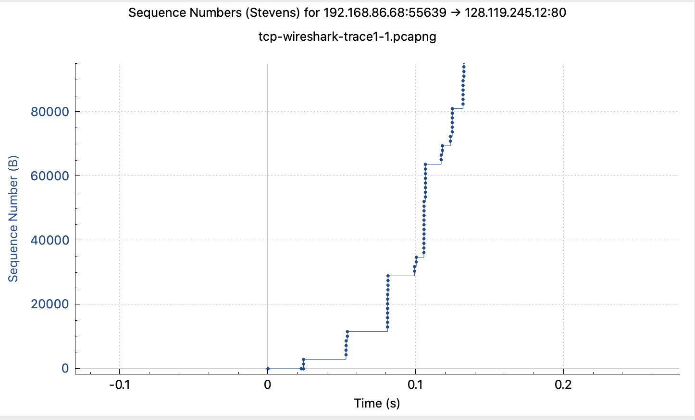
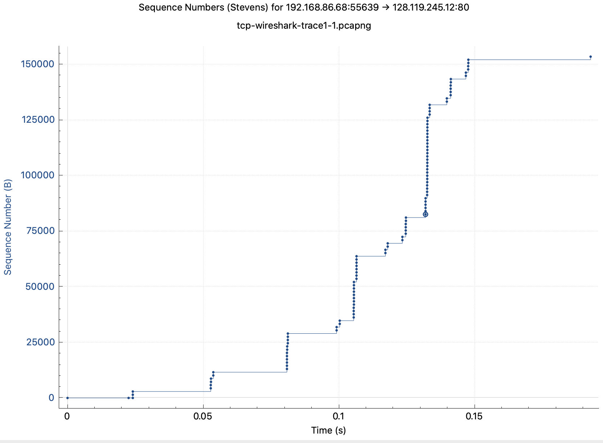

# Lab 3: TCP

Neste laboratório, investigaremos em detalhes o comportamento do famoso protocolo TCP. Faremos isso analisando um rastreamento dos segmentos TCP enviados e recebidos na transferência de um arquivo de 150 KB (contendo o texto de Alice's Adventures in Wonderland de Lewis Carrol) do seu computador para um servidor remoto. Estudaremos o uso de números de sequência e confirmação pelo TCP para fornecer transferência confiável de dados; veremos o algoritmo de controle de congestionamento do TCP – início lento e prevenção de congestionamento – em ação; e veremos o mecanismo de controle de fluxo anunciado pelo receptor do TCP. Também consideraremos brevemente a configuração da conexão TCP e investigaremos o desempenho (taxa de transferência e tempo de ida e volta) da conexão TCP entre seu computador e o servidor.

## Capturando uma transferência TCP em massa do seu computador para um servidor remoto

Antes de iniciar nossa exploração do TCP, precisaremos usar o Wireshark para obter um rastreamento de pacote da transferência TCP de um arquivo do seu computador para um servidor remoto. Você fará isso acessando uma página da Web que permitirá inserir o nome de um arquivo armazenado em seu computador (que contém o texto ASCII de Alice no País das Maravilhas) e depois transferir o arquivo para um servidor Web usando o HTTP POST método (ver seção 2.2.3 no texto). Estamos usando o método POST em vez do método GET, pois gostaríamos de transferir uma grande quantidade de dados do seu computador para outro computador. Obviamente, estaremos executando o Wireshark durante esse período para obter o rastreamento dos segmentos TCP enviados e recebidos do seu computador.

- Inicie seu navegador da web. Acesse <http://gaia.cs.umass.edu/wireshark-labs/alice.txt> e recupere uma cópia ASCII de Alice no País das Maravilhas. Armazene isso como um arquivo .txt em algum lugar do seu computador.
- Em seguida, vá para <http://gaia.cs.umass.edu/wireshark-labs/TCP-wireshark-file1.html>. Você deverá ver uma tela parecida com a Figura 1.

- Use o botão de navegação neste formulário para o arquivo no seu computador que você acabou de criar contendo Alice no País das Maravilhas. Não pressione o botão "Enviar o arquivo alice.txt" ainda.
- Agora inicie o Wireshark e inicie a captura de pacotes (consulte o Wireshark Labs anterior se precisar de uma atualização sobre como fazer isso).
- Retornando ao seu navegador, pressione o botão “Faça o upload do arquivo alice.txt” para fazer o upload do arquivo no servidor gaia.cs.umass.edu. Depois que o arquivo for enviado, uma mensagem curta de parabéns será exibida na janela do seu navegador.
- Pare a captura de pacotes Wireshark. Sua janela Wireshark deve parecer semelhante à janela mostrada na Figura 2.

Se você não conseguir executar o Wireshark em uma conexão de rede ativa, você pode baixar um rastreamento de pacote que foi capturado seguindo as etapas acima em um dos computadores do autor [^1]. Além disso, você pode achar valioso baixar esse rastreamento mesmo se você capturou seu próprio rastro e o usou, assim como seu próprio rastro, ao explorar as questões abaixo.

[^1]: Você pode baixar o arquivo zip <http://www-net.cs.umass.edu/wireshark-labs/wireshark-traces-8.1.zip> e extrair o arquivo de rastreamento tcp-wireshark-trace1-1. Este arquivo de rastreamento pode ser usado para responder a este laboratório do Wireshark sem realmente capturar pacotes por conta própria. Este rastreamento foi feito utilizando o Wireshark rodando em um dos computadores do autor, enquanto realizava os passos indicados neste laboratório do Wireshark. Depois de baixar um arquivo de rastreamento, você pode carregá-lo no Wireshark e visualizar o rastreamento usando o menu suspenso Arquivo, escolhendo Abrir e selecionando o nome do arquivo de rastreamento.

## Um primeiro olhar sobre o rastreamento capturado

Antes de analisar detalhadamente o comportamento da conexão TCP, vamos dar uma visão geral do rastreamento. Vamos começar examinando a mensagem HTTP POST que carregou o arquivo alice.txt para gaia.cs.umass.edu do seu computador. Encontre esse arquivo em seu rastreamento do Wireshark e expanda a mensagem HTTP para que possamos dar uma olhada na mensagem HTTP POST com mais cuidado. Sua tela do Wireshark deve se parecer com a Figura 3.

Há algumas coisas a serem observadas aqui:

- O corpo da mensagem HTTP POST da camada de aplicativo contém o conteúdo do arquivo alice.txt, que é um arquivo grande com mais de 152 K bytes. OK – não é tão grande, mas vai ser muito grande para esta mensagem HTTP POST estar contida em apenas um segmento TCP!
- De fato, conforme mostrado na janela do Wireshark na Figura 3, vemos que a mensagem HTTP POST foi espalhada por 106 segmentos TCP. Isso é mostrado onde a seta vermelha é colocada na Figura 3 (Aparte: o Wireshark não tem uma seta vermelha assim; nós o adicionamos à figura para ser útil). Se você olhar com mais cuidado, verá que o Wireshark também está sendo muito útil para você, informando que o primeiro segmento TCP que contém o início da mensagem POST é o pacote nº 4 no rastreamento específico para o exemplo da Figura 3 , que é o rastreamento tcp-wireshark-trace1-1 observado na nota de rodapé 2. O segundo segmento TCP contendo a mensagem POST no pacote #5 no rastreamento e assim por diante.

Vamos agora “sujar as mãos” olhando alguns segmentos TCP.

- Primeiro, filtre os pacotes exibidos na janela do Wireshark digitando “tcp” (minúsculas, sem aspas, e não se esqueça de pressionar Enter após digitar!) Sua tela do Wireshark deve se parecer com a Figura 4. Na Figura 4, observamos o segmento TCP que tem seu bit SYN definido – esta é a primeira mensagem TCP no handshake de três vias que configura a conexão TCP para gaia.cs .umass.edu que eventualmente carregará a mensagem HTTP POST e o arquivo alice.txt. Também notamos o segmento SYNACK (a segunda etapa do handshake de três vias TCP), bem como o segmento TCP (pacote nº 4, conforme discutido acima) que carrega a mensagem POST e o início do arquivo alice.txt. Claro, se você estiver pegando seu próprio arquivo de rastreamento, os números dos pacotes serão diferentes, mas você deverá ver um comportamento semelhante ao mostrado nas Figuras 3 e 4.

Responda às perguntas a seguir, a partir de seu próprio rastreamento ao vivo ou abrindo o arquivo de pacote capturado pelo Wireshark tcp-wireshark-trace1-1 em <http://gaia.cs.umass.edu/wireshark-labs/wireshark-traces-8.1.zip>.

1. Qual é o endereço IP e o número da porta TCP usados pelo computador cliente (origem) que está transferindo o arquivo alice.txt para gaia.cs.umass.edu? Para responder a essa pergunta, provavelmente é mais fácil selecionar uma mensagem HTTP e explorar os detalhes do pacote TCP usado para transportar essa mensagem HTTP, usando os “detalhes da janela de cabeçalho do pacote selecionado” (consulte a Figura 2 em “Introdução à Wireshark” Lab se você não tiver certeza sobre as janelas do Wireshark).
2. Qual é o endereço IP de gaia.cs.umass.edu? Em qual número de porta ele está enviando e recebendo segmentos TCP para esta conexão?

Como este laboratório é sobre TCP em vez de HTTP, agora altere a janela "listing of captured packets" do Wireshark para que mostre informações sobre os segmentos TCP que contêm as mensagens HTTP, em vez das mensagens HTTP, como na Figura 4 acima. Isso é o que estamos procurando - uma série de segmentos TCP enviados entre seu computador e gaia.cs.umass.edu!

## Noções básicas de TCP

Responda as seguintes perguntas para os segmentos TCP:

3. Qual é o número de sequência do segmento TCP SYN que é usado para iniciar a conexão TCP entre o computador cliente e o gaia.cs.umass.edu? (Nota: este é o número de sequência “bruto” carregado no próprio segmento TCP; NÃO é o pacote # na coluna “Não.” na janela Wireshark. Lembre-se de que não existe um “número de pacote” no TCP ou UDP; como você sabe, existem números de seqüência no TCP e é isso que estamos procurando aqui. Observe também que este não é o número de seqüência relativo em relação ao número de seqüência inicial desta sessão TCP.). O que há neste segmento TCP que identifica o segmento como um segmento SYN?
4. Qual é o número de sequência do segmento SYNACK enviado por gaia.cs.umass.edu ao computador cliente em resposta ao SYN? O que há no segmento que identifica o segmento como um segmento SYNACK? Qual é o valor do campo Acknowledgement no segmento SYNACK? Como gaia.cs.umass.edu determinou esse valor?
5. Qual é o número de sequência do segmento TCP que contém o cabeçalho do comando HTTP POST? Observe que, para encontrar o cabeçalho da mensagem POST, você precisará cavar o campo de conteúdo do pacote na parte inferior da janela do Wireshark, procurando um segmento com o texto ASCII “POST” dentro do campo DATA [^2] [^3]. Quantos bytes de dados estão contidos no campo de carga útil (dados) deste segmento TCP? Todos os dados no arquivo transferido alice.txt se encaixam nesse único segmento?

[^2]: Dica: este segmento TCP é enviado pelo cliente logo (mas nem sempre imediatamente) após o segmento SYNACK ser recebido do servidor.
[^3]: Observe que, se você filtrar para mostrar apenas mensagens “http”, verá que o segmento TCP que o Wireshark associa à mensagem HTTP POST é o último segmento TCP na conexão (que contém o texto no final de alice.txt: “THE END”) e não o primeiro segmento de transporte de dados na conexão. Alunos (e professores!) muitas vezes acham isso inesperado e/ou confuso.

6. Considere o segmento TCP contendo o HTTP “POST” como o primeiro segmento na parte de transferência de dados da conexão TCP.
    - Em que momento foi enviado o primeiro segmento (aquele que contém o HTTP POST) na parte de transferência de dados da conexão TCP?
    - A que horas foi recebido o ACK para este primeiro segmento contendo dados?
    - Qual é o RTT para este primeiro segmento contendo dados?
    - Qual é o valor RTT do segundo segmento TCP que transporta dados e seu ACK?
Nota: O Wireshark tem um bom recurso que permite plotar o RTT para cada um dos segmentos TCP enviados. Selecione um segmento TCP na janela "lista de pacotes capturados" que está sendo enviado do cliente para o servidor gaia.cs.umass.edu. Em seguida, selecione: Estatísticas->Gráfico de fluxo TCP->Gráfico de tempo de viagem de ida e volta.
7. Qual é o comprimento (cabeçalho mais carga útil) de cada um dos quatro primeiros segmentos TCP de transporte de dados? [^4]

[^4]: Os segmentos TCP no arquivo de rastreamento tcp-wireshark-trace1-1 têm menos de 1480 bytes. Isso ocorre porque o computador no qual o rastreamento foi coletado possui uma placa de interface que limita o comprimento máximo do datagrama IP a 1500 bytes e há um mínimo de 40 bytes de dados de cabeçalho TCP/IP. Esse valor de 1500 bytes é um comprimento máximo bastante típico para um datagrama IP da Internet.

8. Qual é a quantidade mínima de espaço de buffer disponível anunciado ao cliente por gaia.cs.umass.edu entre esses quatro primeiros segmentos TCP de transporte de dados[^5]? A falta de espaço no buffer do receptor estrangula o remetente para esses quatro primeiros segmentos de transporte de dados?

[^5]: Give the Wireshark-reported value for “Window Size Value” which must then be multiplied by the Window Scaling Factor to give the actual number of buffer bytes available at gaia.cs.umass.edu for this connection.

9. Existem segmentos retransmitidos no arquivo de rastreamento? O que você verificou (no rastreamento) para responder a essa pergunta?
10. Quantos dados o receptor normalmente reconhece em um ACK entre os dez primeiros segmentos de transporte de dados enviados do cliente para gaia.cs.umass.edu? Você pode identificar casos em que o receptor é ACK em todos os outros segmentos recebidos entre esses dez primeiros segmentos de transporte de dados?
11. Qual é a taxa de transferência (bytes transferidos por unidade de tempo) para a conexão TCP? Explique como você calculou esse valor.

## Controle de congestionamento TCP em ação

Vamos agora examinar a quantidade de dados enviados por unidade de tempo do cliente para o servidor. Em vez de (tediosamente!) calcular isso a partir dos dados brutos na janela do Wireshark, usaremos um dos utilitários de gráficos TCP do Wireshark ‒ Time-Sequence-Graph (Stevens) ‒ para plotar os dados.

- Selecione um segmento TCP enviado pelo cliente na janela “lista de pacotes capturados” do Wireshark correspondente à transferência de alice.txt do cliente para gaia.cs.umass.edu. Em seguida, selecione o menu: Statistics->TCP Stream Graph-> Time-Sequence-Graph(Stevens[^6]). Você deverá ver um gráfico semelhante ao gráfico da Figura 5, que foi criado a partir dos pacotes capturados no rastreamento de pacote tcp-wireshark-trace1-1. Você pode ter que expandir, encolher e mexer nos intervalos mostrados nos eixos para que seu gráfico fique parecido com a Figura 5.

[^6]: William Stevens escreveu o livro “bíblia” sobre TCP, conhecido como [TCP Illustrated](https://www.amazon.com/TCP-Illustrated-Vol-Addison-Wesley-Professional/dp/0201633469).

Aqui, cada ponto representa um segmento TCP enviado, traçando o número de sequência do segmento versus o momento em que foi enviado. Observe que um conjunto de pontos empilhados um sobre o outro representa uma série de pacotes (às vezes chamado de "frota" de pacotes) que foram enviados um ao lado do outro pelo remetente.

Responda a seguinte pergunta para os segmentos TCP no rastreamento de pacote tcp-wireshark-trace1-1 (veja a nota de rodapé 1 anterior):

12. Use a ferramenta de plotagem Time-Sequence-Graph(Stevens) para visualizar o gráfico de número de sequência versus tempo dos segmentos que estão sendo enviados do cliente para o servidor gaia.cs.umass.edu. Considere as "frotas" de pacotes enviados em torno de t = 0,025, t = 0,053, t = 0,082 e t = 0,1. Comente se parece que o TCP está em sua fase de início lento, fase de prevenção de congestionamento ou alguma outra fase. A Figura 6 mostra uma visão ligeiramente diferente desses dados.
13. Essas “frotas” de segmentos parecem ter alguma periodicidade. O que você pode dizer sobre o período?
14. Responda a cada uma das duas perguntas acima para o rastreamento que você coletou quando transferiu um arquivo do seu computador para gaia.cs.umass.edu.

