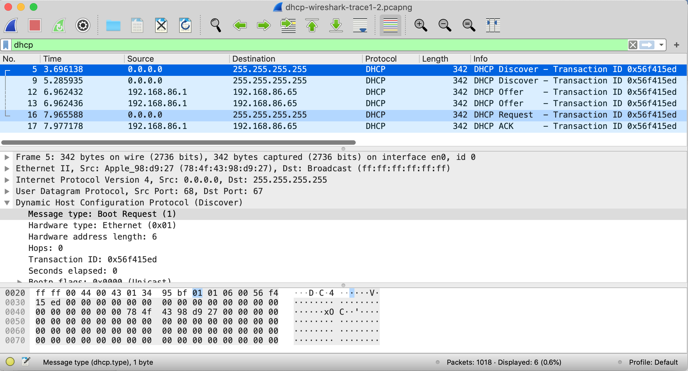

# Lab 5

Neste laboratório, veremos rapidamente o protocolo de configuração de host dinâmico, DHCP. Lembre-se de que o DHCP é amplamente usado em LANs corporativas, universitárias e domésticas com e sem fio para atribuir dinamicamente endereços IP a hosts, bem como para configurar outras informações de configuração de rede, estudando as mensagens DHCP Discover, Offer, Request e ACK.

Como fizemos nos laboratórios anteriores do Wireshark, você executará algumas ações em seu computador que farão com que o DHCP entre em ação e, em seguida, use o Wireshark para coletar e, em seguida, o rastreamento de pacote contendo as mensagens do protocolo DHCP.

## Reunindo um Rastreamento de Pacote

As duas primeiras etapas no protocolo DHCP usando as mensagens Discover e Offer são opcionais (no sentido de que nem sempre precisam ser usadas quando, por exemplo, um novo endereço IP é necessário ou um endereço DHCP existente deve ser renovado); as mensagens Request e ACK não são. Para coletar um rastreamento que conterá todos os quatro tipos de mensagens DHCP, precisaremos executar algumas ações de linha de comando em um Mac, Linux ou PC.

No Mac:

Em um Mac:

1. Em uma janela/shell do terminal, digite o seguinte comando:

```shell
sudo ipconfig set en0 none
```

Onde en0 (neste exemplo) é a interface na qual você deseja capturar pacotes usando o Wireshark. Você pode encontrar facilmente a lista de nomes de interface no Wireshark escolhendo Capturar->opções. Este comando irá desconfigurar a interface de rede en0.

2. Inicie o Wireshark, capturando pacotes na interface desconfigurada no Passo 1.
3. Na janela/shell do terminal, insira o seguinte comando:

```shell
sudo ipconfig set en0 dhcp
```

Isso fará com que o protocolo DHCP solicite e receba um endereço IP e outras informações do servidor DHCP.

4. Após aguardar alguns segundos, interrompa a captura do Wireshark.

Em uma máquina Linux:

1. Em uma janela/shell do terminal, digite os seguintes comandos:

```shell
sudo ip addr flush en0

sudo dhclient -r
```

onde en0 (neste exemplo) é a interface na qual você deseja capturar pacotes usando o Wireshark. Você pode encontrar facilmente a lista de nomes de interface no Wireshark escolhendo Capturar -> Opções. Este comando removerá o endereço IP existente da interface e liberará quaisquer concessões de endereço DHCP existentes.

2. Inicie o Wireshark, capturando os pacotes na interface desconfigurada no Passo 1.
3. Na janela/shell do terminal, digite o seguinte comando:

```shell
sudo dhclient en0
```

onde, como acima, en0 é a interface na qual você está capturando pacotes no momento. Isso fará com que o protocolo DHCP solicite e receba um endereço IP e outras informações do servidor DHCP.

4. Após aguardar alguns segundos, interrompa a captura do Wireshark.

No Windows:

1. Em uma janela de linha de comando, digite o seguinte comando:

```cmd
ipconfig /release
```

Este comando fará com que seu PC desista de seu endereço IP.

2. Inicie o Wireshark.
3. Na janela da linha de comando, digite o seguinte comando:

```cmd
ipconfig /renew
```

Isso fará com que o protocolo DHCP solicite e receba um endereço IP e outras informações de um servidor DHCP.

4. Após aguardar alguns segundos, interrompa a captura do Wireshark.

Depois de interromper a captura do Wireshark na etapa 4, você deve dar uma olhada na janela do Wireshark para garantir que realmente capturou os pacotes que estamos procurando. Se você inserir “dhcp” no campo de filtro de exibição (como mostrado no campo verde claro no canto superior esquerdo da Figura 1), sua tela deve ser semelhante à Figura 1.



Se você não conseguir executar o Wireshark em uma conexão de rede ao vivo, não conseguir capturar todas as quatro mensagens DHCP ou for designado para isso pelo seu instrutor, você pode usar o arquivo de rastreamento do Wireshark, dhcp-wireshark-trace1-1.pcapng [^1] que reunimos seguindo as etapas acima em um dos computadores do autor. Você pode achar valioso fazer o download desse rastreamento, mesmo que tenha capturado seu próprio rastreamento e usado, bem como seu próprio rastreamento, enquanto explora as questões a seguir. Vamos começar examinando a mensagem DHCP Discover. Localize o datagrama IP contendo a primeira mensagem Discover em seu rastreamento.

1. Esta mensagem DHCP Discover é enviada usando UDP ou TCP como o protocolo de transporte subjacente?
2. Qual é o endereço IP de origem usado no datagrama IP que contém a mensagem Discover? Há algo de especial neste endereço? Explique.
3. Qual é o endereço IP de destino usado no datagrama que contém a mensagem Discover. Há algo de especial neste endereço? Explique.
4. Qual é o valor no campo ID da transação desta mensagem DHCP Discover?
5. Agora inspecione o campo de opções na mensagem DHCP Discover. Quais são as cinco informações (além de um endereço IP) que o cliente está sugerindo ou solicitando para receber do servidor DHCP como parte dessa transação DHCP?

Agora vamos ver a mensagem DHCP Offer. Localize o datagrama IP contendo a mensagem DHCP Offer em seu rastreamento que foi enviada por um servidor DHCP em resposta à mensagem DHCP Discover que você estudou nas questões 1-5 acima.

6. Como você sabe que esta mensagem Offer está sendo enviada em resposta à mensagem DHCP Discover que você estudou nas questões 1-5 acima?
7. Qual é o endereço IP de origem usado no datagrama IP que contém a mensagem Offer? Há algo de especial neste endereço? Explique.
8. Qual é o endereço IP de destino usado no datagrama que contém a mensagem Offer? Há algo de especial neste endereço? Explique. (Atenção: a resposta a esta pergunta pode diferir do que você viu no material. Se você realmente quiser se aprofundar nisso, consulte o DHCP RFC, página 24.)
9. Agora inspecione o campo de opções na mensagem DHCP Offer. Quais são as cinco informações que o servidor DHCP está fornecendo ao cliente DHCP na mensagem DHCP Offer?

Parece que, uma vez que a mensagem DHCP Offer é recebida, o cliente pode ter todas as informações necessárias para prosseguir. No entanto, o cliente pode ter recebido ofertas de vários servidores DHCP e, portanto, é necessária uma segunda fase, com mais duas mensagens obrigatórias – a mensagem de solicitação DHCP cliente-servidor e a mensagem DHCP ACK servidor-cliente. Mas pelo menos o cliente sabe que existe pelo menos um servidor DHCP lá fora! Vamos dar uma olhada na mensagem DHCP Request, lembrando que embora já tenhamos visto uma mensagem Discover em nosso trace, nem sempre é o caso quando uma mensagem DHCP request é enviada.

Localize o datagrama IP contendo a primeira mensagem de solicitação de DHCP em seu rastreamento e responda às seguintes perguntas.

10. Qual é o número da porta de origem UDP no datagrama IP que contém a primeira mensagem DHCP Request em seu rastreamento? Qual é o número da porta de destino UDP que está sendo usado?
11. Qual é o endereço IP de origem no datagrama IP que contém esta mensagem de solicitação? Há algo de especial neste endereço? Explique.
12. Qual é o endereço IP de destino usado no datagrama que contém esta mensagem de solicitação. Há algo de especial neste endereço? Explique.
13. Qual é o valor no campo ID da transação desta mensagem de solicitação de DHCP? Ele corresponde aos IDs de transação das mensagens Discover e Offer anteriores?
14. Agora inspecione o campo de opções na mensagem DHCP Discover e dê uma olhada na “Lista de Solicitação de Parâmetros”. O [DHCP RFC](https://www.ietf.org/rfc/rfc2131.txt) observa que
"O cliente pode informar ao servidor quais parâmetros de configuração o cliente está interessado, incluindo a opção 'lista de solicitação de parâmetros'. A parte de dados desta opção lista explicitamente as opções solicitadas pelo número da etiqueta."
Que diferenças você vê entre as entradas na opção 'lista de solicitação de parâmetro' nesta mensagem de solicitação e a mesma opção de lista na mensagem Discover anterior?

Localize o datagrama IP contendo a primeira mensagem DHCP ACK em seu rastreamento e responda às seguintes perguntas.

15. Qual é o endereço IP de origem no datagrama IP que contém esta mensagem ACK? Há algo de especial neste endereço? Explique.
16. Qual é o endereço IP de destino usado no datagrama que contém esta mensagem ACK. Há algo de especial neste endereço? Explique.
17. Qual é o nome do campo na mensagem DHCP ACK (conforme indicado na janela do Wireshark) que contém o endereço IP do cliente atribuído?
18. Por quanto tempo (o chamado “tempo de concessão”) o servidor DHCP atribuiu este endereço IP ao cliente?
19. Qual é o endereço IP (retornado pelo servidor DHCP para o cliente DHCP nesta mensagem DHCP ACK) do roteador de primeiro salto no caminho padrão do cliente para o restante da Internet?

[^1]: Você pode baixar o arquivo zip <http://gaia.cs.umass.edu/wireshark-labs/wireshark-traces-8.1.zip> e extrair o arquivo de rastreamento dhcp-wireshark-trace1-1.pcapng. Esses arquivos de rastreamento podem ser usados para responder a essas perguntas de laboratório do Wireshark sem realmente capturar pacotes por conta própria. Cada traço foi feito usando o Wireshark rodando em um dos computadores do autor, durante a execução das etapas indicadas no laboratório Wireshark. Depois de baixar um arquivo de rastreamento, você pode carregá-lo no Wireshark e visualizar o rastreamento usando o menu suspenso Arquivo, escolhendo Abrir e, em seguida, selecionando o nome do arquivo de rastreamento.
