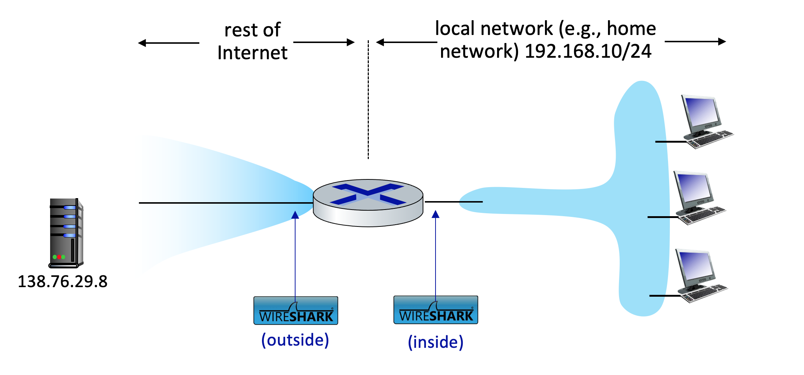

# Lab 6

Neste laboratório, investigaremos o comportamento de um roteador NAT. Este laboratório será diferente de nossos outros laboratórios do Wireshark, onde capturávamos um arquivo de rastreamento em um único ponto de medição do Wireshark. Como estamos interessados em capturar pacotes nos lados de entrada e saída do dispositivo NAT, precisaremos capturar pacotes em dois locais. Além disso, como muitos alunos não têm acesso fácil a um dispositivo NAT ou a dois computadores para fazer medições do Wireshark, este não é um laboratório que pode ser feito facilmente "ao vivo" por um aluno. Portanto, neste laboratório, você usará os arquivos de rastreamento do Wireshark que capturamos para você. Este deve ser um laboratório relativamente curto e fácil, já que os conceitos por trás do NAT não são difíceis, mas será bom observar o NAT em ação.

## Cenário de Medição NAT

Neste laboratório, capturaremos pacotes contendo uma mensagem de solicitação HTTP GET simples de um cliente dentro de uma rede doméstica para um servidor remoto e a resposta HTTP correspondente desse servidor. Dentro da rede doméstica, o roteador da rede doméstica fornece um serviço NAT. A Figura 1 mostra nosso cenário de coleta de rastreamento Wireshark. Capturaremos pacotes em dois locais e, portanto, este laboratório possui dois arquivos de rastreamento:

- Capturaremos os pacotes recebidos no lado da rede local (LAN) do roteador NAT. Todos os dispositivos nesta LAN têm endereços em 192.168.10/24. Este arquivo é denominado nat-inside-wireshark-trace1-1.pcapng[^1].
- Como também estamos interessados em analisar os pacotes encaminhados (e recebidos) pelo roteador NAT em seu lado voltado para a Internet, coletaremos um segundo arquivo de rastreamento no lado da Internet do roteador, conforme mostrado na Figura 1. Pacotes capturados pelo Wireshark neste ponto que foram enviados de um host à direita para o servidor à esquerda terão sofrido tradução NAT no momento em que atingirem esse segundo ponto de medição. Este arquivo é denominado nat-outside-wireshark-trace1-1.pcapng.

[^1]: Você pode baixar o arquivo zip <http://gaia.cs.umass.edu/wireshark-labs/wireshark-traces-8.1.zip> e extrair o arquivo de rastreamento nat-inside-wireshark-trace1-1.pcapng. Esses arquivos de rastreamento podem ser usados para responder a essas perguntas de laboratório do Wireshark sem realmente capturar pacotes por conta própria. Cada traço foi feito usando o Wireshark rodando em um dos computadores do autor, durante a execução das etapas indicadas no laboratório Wireshark. Depois de baixar um arquivo de rastreamento, você pode carregá-lo no Wireshark e visualizar o rastreamento usando o menu suspenso Arquivo, escolhendo Abrir e, em seguida, selecionando o nome do arquivo de rastreamento.

No cenário mostrado na Figura 1, um dos hosts dentro da LAN enviará uma solicitação HTTP GET ao servidor da Web no endereço IP 138.76.29.8, que responderá ao host solicitante. Obviamente, não estamos realmente interessados na solicitação HTTP GET em si, mas sim em como o roteador NAT altera os endereços IP e os números de porta do datagrama que contém a solicitação GET no lado da LAN (dentro) para endereços e números de porta no datagrama de saída encaminhado no lado da Internet (fora) do roteador NAT.

Vamos primeiro dar uma olhada no que está acontecendo no lado da LAN do roteador NAT. Abra o arquivo de rastreio nat-inside-wireshark-trace1-1.pcapng. Neste arquivo, você deve ver uma solicitação HTTP GET endereçada ao servidor web externo no endereço IP 138.76.29.8, bem como a mensagem de resposta HTTP subsequente (“200 OK”). Ambas as mensagens no arquivo de rastreamento foram capturadas no lado LAN do roteador.

Responda as seguintes questões.

1. Qual é o endereço IP do cliente que envia a solicitação HTTP GET no rastreamento nat-inside-wireshark-trace1-1.pcapng? Qual é o número da porta de origem do segmento TCP neste datagrama que contém a solicitação HTTP GET? Qual é o endereço IP de destino desta solicitação HTTP GET? Qual é o número da porta de destino do segmento TCP neste datagrama que contém a solicitação HTTP GET?
2. A que horas a mensagem HTTP 200 OK correspondente do servidor web é encaminhada pelo roteador NAT para o cliente no lado da LAN do roteador?
3. Quais são os endereços IP de origem e destino e as portas TCP de origem e destino no datagrama IP que transporta esta mensagem HTTP 200 OK?

A seguir vamos nos concentrar nessas duas mensagens HTTP (GET e 200 OK). Nosso objetivo a seguir será localizar essas duas mensagens HTTP no arquivo de rastreamento nat-outside-wireshark-trace1-1.pcapng, capturado no link do lado da Internet entre o roteador e o ISP. Como os pacotes capturados em direção ao servidor já foram encaminhados pelo roteador NAT, alguns dos endereços IP e números de porta foram alterados como resultado da conversão do NAT.

Abra o arquivo de rastreamento nat-outside-wireshark-trace1-1.pcapng. Observe que os timestamps neste arquivo e o arquivo nat-inside-wireshark-trace1-1.pcapng não são necessariamente sincronizados.

No arquivo de rastreamento nat-outside-wireshark-trace1-1.pcapng, localize a mensagem HTTP GET que corresponde à mensagem HTTP GET que foi enviada do cliente para o servidor 138.76.29.8 no tempo t=0,27362245, onde t=0,27362245 é a hora em que esta mensagem foi enviada, conforme registrado no arquivo de rastreio nat-inside-wireshark-trace1-1.pcapng.

4. A que horas essa mensagem HTTP GET aparece no arquivo de rastreamento nat-outside-wireshark-trace1-1.pcapng?
5. Quais são os endereços IP de origem e destino e os números de porta TCP de origem e destino no datagrama IP que carrega este HTTP GET (conforme registrado no arquivo de rastreamento nat-outside-wireshark-trace1-1.pcapng)?
6. Quais desses quatro campos são diferentes da sua resposta à pergunta 1 acima?
7. Algum campo na mensagem HTTP GET foi alterado?
8. Quais dos seguintes campos no datagrama IP que transportam o HTTP GET são alterados do datagrama recebido na rede local (dentro) para o datagrama correspondente encaminhado no lado da Internet (fora) do roteador NAT: Versão, Tamanho do Cabeçalho, Flags, checksum?

Vamos continuar a examinar o arquivo de rastreamento nat-outside-wireshark-trace1-1.pcapng. Encontre a resposta HTTP contendo a mensagem “200 OK” que foi recebida em resposta à solicitação HTTP GET que você acabou de examinar nas questões 4-8 acima.

9. A que horas essa mensagem aparece no arquivo de rastreamento nat-outside-wireshark-trace1-1.pcapng?
10. Quais são os endereços IP de origem e destino e os números de porta TCP de origem e destino no datagrama IP que carrega esta mensagem de resposta HTTP (“200 OK”) (conforme registrado no arquivo de rastreamento nat-outside-wireshark-trace1-1.pcapng)?

Por fim, vamos considerar o que acontece quando o roteador NAT recebe este datagrama que você examinou nas perguntas 9 e 10, executa a tradução NAT e finalmente encaminha esse datagrama para o host de destino no lado da LAN. Com base em suas respostas às perguntas de 1 a 10 acima e em seu conhecimento de como o NAT funciona, você deve ser capaz de responder à seguinte pergunta sem realmente olhar para o arquivo de rastreamento nat-inside-wireshark-trace1-1.pcapng:

11. Quais são os endereços IP de origem e destino e os números de porta TCP de origem e destino no datagrama IP que carrega a resposta HTTP (“200 OK”) que é encaminhado do roteador para o host de destino à direita da Figura 1?

Apenas para ter certeza de que você entendeu o NAT, agora você deve usar o Wireshark para espiar o arquivo de rastreamento nat-inside-wireshark-trace1-1.pcapng e ver a resposta HTTP (“200 OK”).
Suas respostas à pergunta 11 acima correspondem ao que você vê no arquivo de rastreamento nat-inside-wireshark-trace1-1.pcapng? (Espero que sua resposta seja sim!).

É isso! Veja, nós dissemos a você que este laboratório Wireshark NAT não seria difícil!
