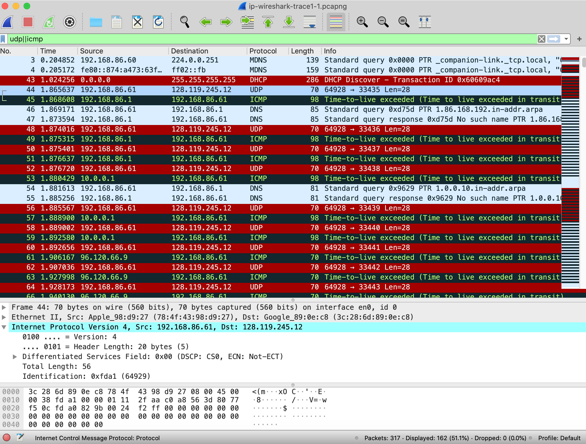
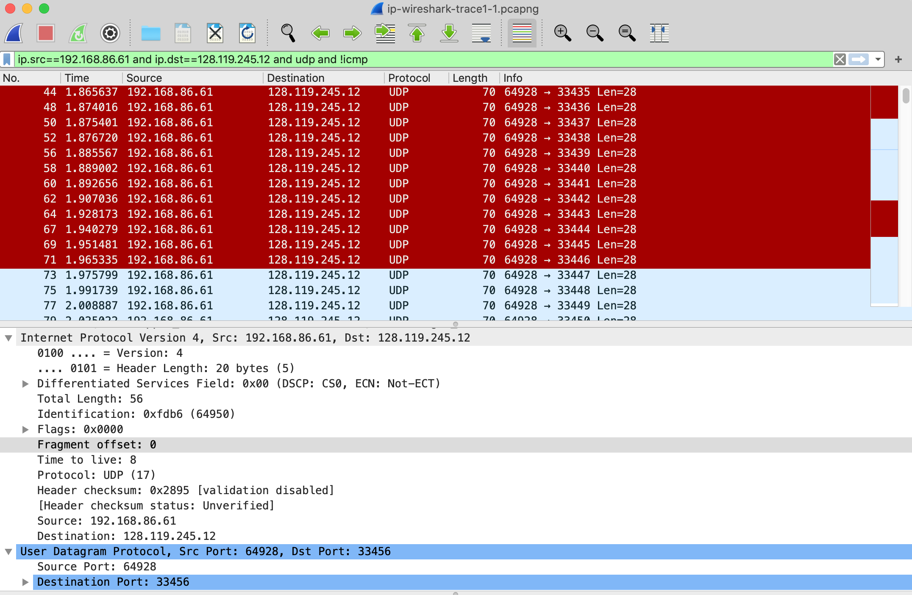
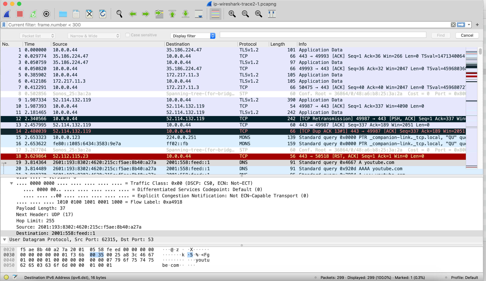

# Lab 7

Neste laboratório, investigaremos o célebre protocolo IP, com foco nos datagramas IPv4 e IPv6. Este laboratório tem três partes. Na primeira parte, analisaremos os pacotes em um rastreamento de datagramas IPv4 enviados e recebidos pelo programa traceroute (o próprio programa traceroute é explorado com mais detalhes no laboratório sobre ICMP). Estudaremos a fragmentação de IP na Parte 2 deste laboratório e veremos rapidamente o IPv6 na Parte 3 deste laboratório.

Para se atualizar sobre o funcionamento do programa traceroute, acesse o [RFC 2151](https://tools.ietf.org/html/rfc2151). Você também vai querer também ter o [RFC 791](https://tools.ietf.org/html/rfc2151) em mãos, para uma discussão sobre o protocolo IP. Se você responder às perguntas sobre fragmentação de IP, certamente também desejará revisar o material sobre fragmentação de IP.
[RFC 8200](https://tools.ietf.org/html/rfc8200) é o RFC completo para IPv6, mas ler isso é um pouco exagerado para este laboratório; você pode revisar o IPv6 consultando a Seção 4.3.4 no livro.

## Capturando pacotes de uma execução de traceroute

Para gerar um rastreamento de datagramas IPv4 para as duas primeiras partes deste laboratório, usaremos o programa traceroute para enviar datagramas de dois tamanhos diferentes para gaia.cs.umass.edu. Lembre-se de que o traceroute opera enviando primeiro um ou mais datagramas com o campo time-to-live (TTL) no cabeçalho IP definido como 1; ele então envia uma série de um ou mais datagramas para o mesmo destino com um valor TTL de 2; ele então envia uma série de datagramas para o mesmo destino com um valor TTL de 3; e assim por diante. Lembre-se de que um roteador deve diminuir o TTL em cada datagrama recebido em 1 (na verdade, o RFC 791 diz que o roteador deve diminuir o TTL em pelo menos um). Se o TTL atingir 0, o roteador retornará uma mensagem ICMP (tipo 11 – TTL excedido) ao host de envio. Como resultado desse comportamento, um datagrama com um TTL de 1 (enviado pelo host executando o traceroute) fará com que o roteador a um salto do remetente envie uma mensagem ICMP TTL excedida de volta ao remetente; o datagrama enviado com um TTL de 2 fará com que o roteador a dois saltos envie uma mensagem ICMP de volta ao remetente; o datagrama enviado com um TTL de 3 fará com que o roteador a três saltos de distância envie uma mensagem ICMP de volta ao remetente; e assim por diante. Dessa maneira, o host que executa o traceroute pode aprender os endereços IP dos roteadores entre ele e o destino, observando os endereços IP de origem nos datagramas que contêm as mensagens ICMP TTL excedidas.

Vamos executar o traceroute e enviar datagramas de dois tamanhos diferentes. O maior dos dois comprimentos de datagrama exigirá que as mensagens traceroute sejam fragmentadas em vários datagramas IPv4.

Com o comando traceroute do **Linux/MacOS**, o tamanho do datagrama UDP enviado para o destino final pode ser definido explicitamente indicando o número de bytes no datagrama; esse valor é inserido na linha de comando traceroute imediatamente após o nome ou endereço do destino. Por exemplo, para enviar datagramas traceroute de 2000 bytes para gaia.cs.umass.edu, o comando seria:

```shell
traceroute gaia.cs.umass.edu 2000
```

O programa tracert fornecido com o **Windows** não permite alterar o tamanho da mensagem ICMP enviada pelo tracert. Portanto, não será possível usar uma máquina Windows para gerar mensagens ICMP grandes o suficiente para forçar a fragmentação do IP. No entanto, você pode usar o tracert para gerar pacotes pequenos e de comprimento fixo para executar a Parte 1 deste laboratório. No prompt de comando do DOS, digite:

```cmd
tracert gaia.cs.umass.edu
```

Se você quiser fazer a segunda parte deste laboratório, você pode baixar um arquivo de rastreamento de pacote que foi capturado em um dos computadores do autor[^1].

[^1]: Você pode baixar o arquivo zip <http://gaia.cs.umass.edu/wireshark-labs/wireshark-traces-8.1.zip> e extrair o arquivo de rastreamento ip-wireshark-trace1-1.pcapng. Este arquivo de rastreamento pode ser usado para responder a essas perguntas de laboratório do Wireshark sem realmente capturar pacotes por conta própria. O rastreamento foi feito usando o Wireshark rodando em um dos computadores do autor, durante a execução das etapas deste laboratório do Wireshark. Depois de baixar um arquivo de rastreamento, você pode carregá-lo no Wireshark e visualizar o rastreamento usando o menu suspenso Arquivo, escolhendo Abrir e, em seguida, selecionando o nome do arquivo de rastreamento.

Faça o seguinte:

- Inicie o Wireshark e comece a captura de pacotes. (Capture->Start ou clique no botão de barbatana de tubarão azul no canto superior esquerdo da janela do Wireshark).
- Digite dois comandos traceroute, usando gaia.cs.umass.edu como destino, o primeiro com comprimento de 56 bytes. Depois que esse comando terminar de executar, insira um segundo comando traceroute para o mesmo destino, mas com um comprimento de 3.000 bytes.
- Interrompa o rastreamento do Wireshark.

Se você não conseguir executar o Wireshark em uma conexão de rede ao vivo, você pode usar o arquivo de rastreamento de pacotes, ip-wireshark-trace1-1.pcapng, mencionado na nota de rodapé 1. Você pode achar valioso baixar esse rastreamento, mesmo se você Capture seu próprio rastro e use-o, assim como seu próprio rastro, enquanto explora as questões abaixo.

## Parte 1: IPv4 básico

Em seu rastreamento, você deve ser capaz de ver a série de segmentos UDP (no caso de MacOS/Linux) ou mensagens ICMP Echo Request (Windows) enviadas por traceroute em seu computador e as mensagens ICMP TTL excedidas retornadas ao seu computador pelos roteadores intermediários. Nas perguntas abaixo, vamos supor que você esteja usando um computador MacOS/Linux; as perguntas correspondentes para o caso de uma máquina Windows devem ser claras. Sua tela deve ser semelhante à captura de tela da Figura 1, onde usamos o filtro de exibição "udp||icmp" (consulte o campo de filtro de exibição preenchido com verde claro na Figura 1) para que apenas o protocolo UDP e/ou ICMP pacotes são exibidos.



Responda as questões a seguir:

1. Selecione o primeiro segmento UDP enviado por seu computador por meio do comando traceroute para gaia.cs.umass.edu. (Dica: este é o 44º pacote no arquivo de rastreamento no arquivo ip-wireshark-trace1-1.pcapng na nota de rodapé 1). Expanda a parte do Protocolo de Internet do pacote na janela de detalhes do pacote. Qual é o endereço IP do seu computador?
2. Qual é o valor no campo time-to-live (TTL) no cabeçalho deste datagrama IPv4?
3. Qual é o valor no campo de protocolo da camada superior no cabeçalho deste datagrama IPv4? (Nota: as respostas para Linux/MacOS diferem do Windows aqui).
4. Quantos bytes há no cabeçalho IP?
5. Quantos bytes há no payload do datagrama IP? Explique como você determinou o número de bytes de carga útil.
6. Este datagrama IP foi fragmentado? Explique como você determinou se o datagrama foi ou não fragmentado.

A seguir, vejamos a sequência de segmentos UDP sendo enviados de seu computador via traceroute, destinados a 128.119.245.12. O filtro de exibição que você pode inserir para fazer isso é "ip.src==192.168.86.61 e ip.dst==128.119.245.12 e udp e !icmp". Isso permitirá que você mova facilmente sequencialmente apenas os datagramas contendo apenas esses segmentos. Sua tela deve ser semelhante à Figura 2.



7. Quais campos do datagrama IP sempre mudam de um datagrama para o outro dentro dessa série de segmentos UDP enviados pelo seu computador com destino a 128.119.245.12, via traceroute? Por quê?
8. Quais campos nesta sequência de datagramas IP (contendo segmentos UDP) permanecem constantes? Por quê?
9. Descreva o padrão que você vê nos valores no campo Identificação dos datagramas IP enviados pelo seu computador.

Agora, vamos dar uma olhada nos pacotes ICMP sendo retornados ao seu computador pelos roteadores intervenientes, onde o valor TTL foi diminuído para zero (e, portanto, fez com que a mensagem de erro ICMP fosse retornada ao seu computador). O filtro de exibição que você pode usar para mostrar apenas esses pacotes é "ip.dst==192.168.86.61 e icmp".

10. Qual é o protocolo da camada superior especificado nos datagramas IP retornados dos roteadores? (Nota: as respostas para Linux/MacOS diferem do Windows aqui).
11. Os valores nos campos de identificação (através da sequência de todos os pacotes ICMP de todos os roteadores) são semelhantes em comportamento à sua resposta à pergunta 9 acima?
12. Os valores dos campos TTL são semelhantes em todos os pacotes ICMP de todos os roteadores?

## Parte 2: Fragmentação

Nesta seção, veremos um segmento UDP grande (3.000 bytes) enviado pelo programa traceroute que é fragmentado em vários datagramas IP. Para responder as questões a seguir, classifique a lista de pacotes da Parte 1, com todos os filtros de exibição limpos, de acordo com o tempo, clicando na coluna Tempo.

13. Encontre o primeiro datagrama IP contendo a primeira parte do segmento enviado para 128.119.245.12 enviado pelo seu computador através do comando traceroute para gaia.cs.umass.edu, depois de especificar que o comprimento do pacote traceroute deve ser 3000. (Dica : Este é o pacote 179 no arquivo de rastreamento ip-wireshark-trace1-1.pcapng na nota de rodapé 2. Os pacotes 179, 180 e 181 são três datagramas IP criados pela fragmentação do primeiro segmento UDP de 3000 bytes enviado para 128.119.145.12) . Esse segmento foi fragmentado em mais de um datagrama IP? (Dica: a resposta é sim[^2]!)
14. Que informação no cabeçalho IP indica que este datagrama foi fragmentado?
15. Quais informações no cabeçalho IP deste pacote indicam se este é o primeiro fragmento ou um fragmento posterior?
16. Quantos bytes há neste datagrama IP (cabeçalho mais payload)?
17. Agora inspecione o datagrama contendo o segundo fragmento do segmento UDP fragmentado. Que informação no cabeçalho IP indica que este não é o primeiro fragmento de datagrama?
18. Quais campos mudam no cabeçalho IP entre o primeiro e o segundo fragmento?
19. Agora encontre o datagrama IP contendo o terceiro fragmento do segmento UDP original. Que informação no cabeçalho IP indica que este é o último fragmento daquele segmento?

[^2]: Nota: se você achar que seu pacote não foi fragmentado, você deve baixar o arquivo zip na nota de rodapé 1 e extrair o arquivo de rastreamento ip-wireshark-trace1-1.pcapng . Se o seu computador tiver uma interface Ethernet ou WiFi, um tamanho de pacote de 3000 deve causar fragmentação.

## Parte 3: IPv6

Nesta seção final, daremos uma olhada rápida no datagrama IPv6 usando o Wireshark. Como a Internet ainda está principalmente na rede IPv4 e seu próprio computador ou seu ISP pode não estar configurado para IPv6, vamos ver um rastreamento de pacotes já capturados que contêm alguns pacotes IPv6. Para gerar esse rastreamento, nosso navegador da Web abriu a página inicial do youtube.com. O Youtube (e o Google) fornecem suporte bastante amplo para IPv6.

Abra o arquivo ip-wireshark-trace2-1.pcapng no arquivo .zip de rastreamentos fornecido na nota de rodapé 1. A exibição do Wireshark deve ser semelhante à Figura 3.



Vamos começar examinando mais de perto o 20º pacote neste rastreamento, enviado em t=3,814489. Esta é uma solicitação DNS (contida em um datagrama IPv6) para um servidor DNS IPv6 para o endereço IPv6 de youtube.com. O tipo de solicitação DNS AAAA é usado para resolver nomes para endereços IP IPv6.

Responda as seguintes questões:

20. Qual é o endereço IPv6 do computador que faz a solicitação DNS AAAA? Este é o endereço de origem do vigésimo pacote no rastreamento. Forneça o endereço de origem IPv6 para este datagrama exatamente da mesma forma exibida na janela do Wireshark[^3].
21. Qual é o endereço de destino IPv6 para este datagrama? Forneça este endereço IPv6 exatamente da mesma forma exibida na janela do Wireshark.
22. Qual é o valor do rótulo de fluxo para este datagrama?
23. Quantos dados de carga útil são transportados neste datagrama?
24. Qual é o protocolo da camada superior para o qual a carga útil deste datagrama será entregue no destino?

[^3]: Lembre-se de que um endereço IPv6 é mostrado como 8 conjuntos de 4 dígitos hexadecimais, com cada conjunto separado por dois pontos e com zeros à esquerda omitidos. Se um endereço IPv6 tiver dois dois-pontos seguidos ('::'), isso significa que todos os bytes intermediários entre os dois dois-pontos são zero. Assim, por exemplo, fe80::1085:6434:583:e79 é uma abreviação de fe80:0000:0000:0000:1085:6434:0583:0e79. Certifique-se de entender este exemplo.

Por fim, encontre a resposta do DNS IPv6 para a solicitação AAAA do DNS IPv6 feita no 20º pacote neste rastreamento. Esta resposta DNS contém endereços IPv6 para youtube.com.

25. Quantos endereços IPv6 são retornados em resposta a esta solicitação AAAA?
26. Qual é o primeiro endereço IPv6 retornado pelo DNS para youtube.com (no arquivo de rastreamento ip-wireshark-trace2-1.pcapng, este também é o endereço numericamente menor)? Forneça este endereço IPv6 exatamente da mesma forma abreviada exibida na janela do Wireshark.
