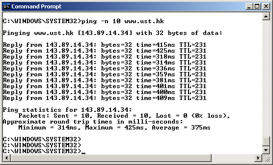
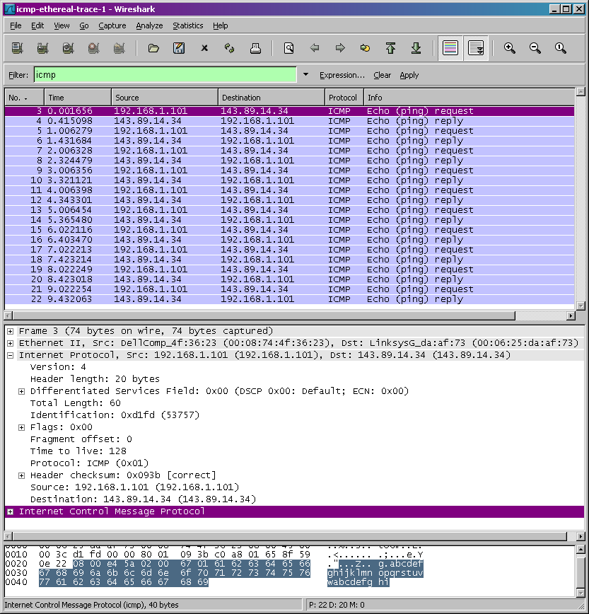
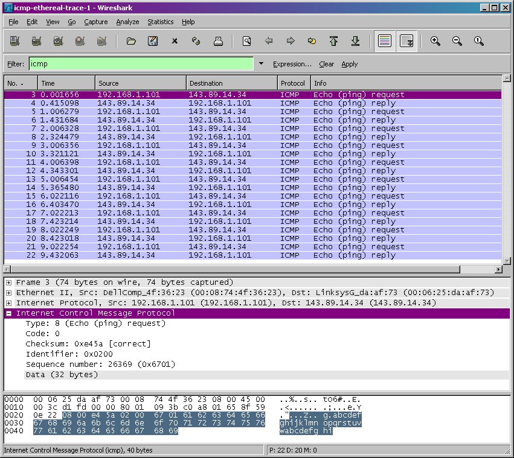
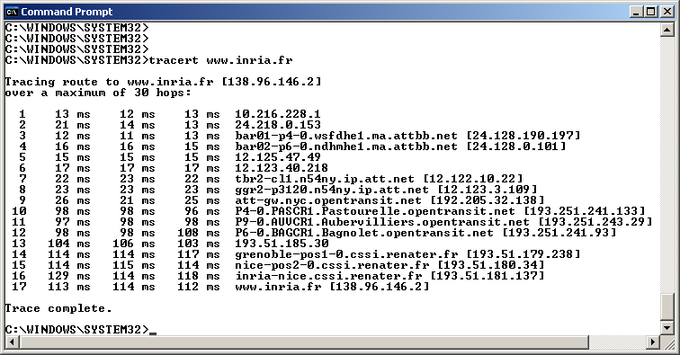
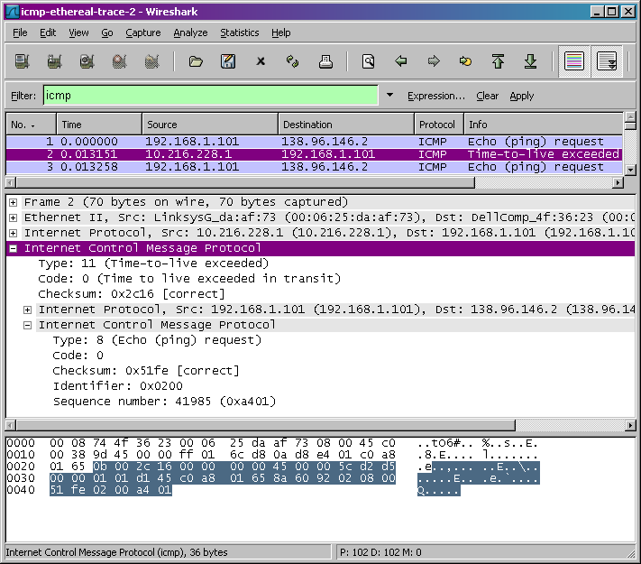

# Lab 8

Neste laboratório, exploraremos vários aspectos do protocolo ICMP:

- Mensagens ICMP geradas pelo programa Ping
- Mensagens ICMP geradas pelo programa Traceroute
- O formato e o conteúdo de uma mensagem ICMP

Apresentamos este laboratório no contexto do sistema operacional Microsoft Windows. No entanto, é fácil traduzir o laboratório para um ambiente Unix ou Linux.

Vamos começar nossa aventura ICMP capturando os pacotes gerados pelo programa Ping. Você deve se lembrar que o programa Ping é uma ferramenta simples que permite a qualquer pessoa (por exemplo, um administrador de rede) verificar se um host está ativo ou não. O programa Ping no host de origem envia um pacote para o endereço IP de destino; se o destino estiver ativo, o programa Ping no host de destino responde enviando um pacote de volta ao host de origem. Como você deve ter adivinhado (já que este laboratório é sobre ICMP), ambos os pacotes Ping são pacotes ICMP.

Faça o seguinte[^1]:

[^1]: Se você não conseguir executar o Wireshark ao vivo em um computador, faça o download do arquivo zip <http://gaia.cs.umass.edu/wireshark-labs/wireshark-traces.zip> e extraia o arquivo ICMP-ethereal-trace-1. Os traços neste arquivo zip foram coletados pelo Wireshark rodando em um dos computadores do autor, durante a execução das etapas indicadas no laboratório Wireshark. Depois de baixar o rastreamento, você pode carregá-lo no Wireshark e visualizar o rastreamento usando o menu suspenso Arquivo, escolhendo Abrir e, em seguida, selecionando o arquivo de rastreamento ICMP-ethereal-trace-1. Você pode usar esse arquivo de rastreamento para responder às perguntas abaixo.

- Vamos começar esta aventura abrindo o aplicativo Windows Command Prompt (que pode ser encontrado na pasta Acessórios).
- Inicie o sniffer de pacotes Wireshark e inicie a captura de pacotes Wireshark.
- O comando ping está em c:\windows\system32, então digite "ping –n 10 hostname" ou "c:\windows\system32\ping –n 10 hostname" na linha de comando do MS-DOS (sem as aspas), onde hostname é um host em outro continente. Pode ser direcionado ao site www.ust.hk para o servidor Web da Hong Kong University of Science and Technology, por exemplo. O argumento "-n 10" indica que 10 mensagens de ping devem ser enviadas. Em seguida, execute o programa Ping digitando return.
- Quando o programa Ping terminar, pare a captura do pacote no Wireshark.

Ao final do experimento, sua janela de prompt de comando deve se parecer com a Figura 1. Neste exemplo, o programa ping de origem está em Massachusetts e o programa ping de destino está em Hong Kong. Nessa janela, vemos que o programa de ping de origem enviou 10 pacotes de consulta e recebeu 10 respostas. Observe também que, para cada resposta, a fonte calcula o tempo de ida e volta (RTT), que para os 10 pacotes é em média 375 ms.

A Figura 2 fornece uma captura de tela da saída do Wireshark, depois que “icmp” foi inserido na janela de exibição do filtro. Observe que a lista de pacotes mostra 20 pacotes: as 10 consultas de ping enviadas pela fonte e as 10 respostas de ping recebidas pela fonte. Observe também que o endereço IP da fonte é um endereço privado (atrás de um NAT) no formato 192.168/12; o endereço IP do destino é o do servidor Web em HKUST. Agora vamos dar um zoom no primeiro pacote (enviado pelo cliente); na figura abaixo, a área de conteúdo do pacote fornece informações sobre este pacote. Vemos que o datagrama IP dentro deste pacote tem o protocolo número 01, que é o número do protocolo ICMP. Isso significa que a carga útil do datagrama IP é um pacote ICMP.

A Figura 3 concentra-se no mesmo ICMP, mas expandiu as informações do protocolo ICMP na janela de conteúdo do pacote. Observe que este pacote ICMP é do Tipo 8 e Código 0 - um chamado pacote ICMP "echo request". Observe também que esse pacote ICMP contém uma soma de verificação, um identificador e um número de sequência.

Você deve entregar uma captura de tela da janela do prompt de comando semelhante à Figura 1 acima. Sempre que possível, ao responder a uma pergunta abaixo, você deve entregar uma impressão do(s) pacote(s) dentro do traço que você usou para responder à pergunta feita. Anote a impressão[^2] para explicar sua resposta. Para imprimir um pacote, use Arquivo->Imprimir, escolha Somente pacote selecionado, escolha Linha de resumo do pacote e selecione a quantidade mínima de detalhes do pacote que você precisa para responder à pergunta.

[^2]: O que queremos dizer com "anotar"? Se você entregar uma cópia em papel, destaque onde na impressão você encontrou a resposta e adicione algum texto (de preferência com uma caneta colorida) observando o que você encontrou no que você destacou. Se você entregar uma cópia eletrônica, seria ótimo se também pudesse destacar e anotar.

1. Qual é o endereço IP do seu host? Qual é o endereço IP do host de destino?
2. Por que um pacote ICMP não tem números de porta de origem e destino?
3. Examine um dos pacotes de solicitação de ping enviados por seu host. Quais são o tipo de ICMP e os números de código? Que outros campos esse pacote ICMP possui? Quantos bytes são os campos de soma de verificação, número de sequência e identificador?
4. Examine o pacote de resposta de ping correspondente. Quais são o tipo de ICMP e os números de código? Que outros campos esse pacote ICMP possui? Quantos bytes são os campos de soma de verificação, número de sequência e identificador?

## ICMP e Traceroute

Vamos agora continuar nossa aventura ICMP capturando os pacotes gerados pelo programa Traceroute. Você deve se lembrar que o programa Traceroute pode ser usado para descobrir o caminho que um pacote percorre da origem ao destino.

Traceroute é implementado de diferentes maneiras no Unix/Linux/MacOS e no Windows. No Unix/Linux, a origem envia uma série de pacotes UDP para o destino de destino usando um número de porta de destino improvável; no Windows, a origem envia uma série de pacotes ICMP ao destino de destino. Para ambos os sistemas operacionais, o programa envia o primeiro pacote com TTL=1, o segundo pacote com TTL=2 e assim por diante. Lembre-se de que um roteador diminuirá o valor TTL de um pacote à medida que o pacote passar pelo roteador. Quando um pacote chega a um roteador com TTL=1, o roteador envia um pacote de erro ICMP de volta à origem. A seguir, usaremos o programa tracert nativo do Windows. Uma versão shareware de um excelente programa Windows Traceroute é o pingplotter (www.pingplotter.com). Usaremos o pingplotter em nosso laboratório Wireshark IP, pois ele fornece funcionalidades adicionais que precisaremos lá.

Faça o seguinte[^3]:

[^3]: Se você não conseguir executar o Wireshark ao vivo em um computador, faça o download do arquivo zip <http://gaia.cs.umass.edu/wireshark-labs/wireshark-traces.zip> e extraia o arquivo ICMP-ethereal-trace-2 . Os traços neste arquivo zip foram coletados pelo Wireshark rodando em um dos computadores do autor, durante a execução das etapas indicadas no laboratório Wireshark. Depois de baixar o rastreamento, você pode carregá-lo no Wireshark e visualizar o rastreamento usando o menu suspenso Arquivo, escolhendo Abrir e, em seguida, selecionando o arquivo de rastreamento ICMP-ethereal-trace-2. Você pode usar esse arquivo de rastreamento para responder às perguntas abaixo.

- Vamos começar abrindo o aplicativo Prompt de Comando do Windows (que pode ser encontrado na pasta Acessórios).
- Inicie o sniffer de pacotes Wireshark e inicie a captura de pacotes Wireshark.
- O comando tracert está em c:\windows\system32, então digite "tracert hostname" ou "c:\windows\system32\tracert hostname" na linha de comando do MS-DOS (sem as aspas), onde hostname é um host em outro continente.
- (Observe que em uma máquina Windows, o comando é "tracert" e não "traceroute".) Você pode digitar, por exemplo, www.inria.fr para o servidor Web em INRIA, uma ciência da computação instituto de pesquisa na França. Em seguida, execute o programa Traceroute digitando return.
- Quando o programa Traceroute terminar, pare a captura de pacotes no Wireshark.

No final do experimento, sua janela de prompt de comando deve se parecer com a Figura 4. Nesta figura, o programa cliente Traceroute está em Massachusetts e o destino está na França. A partir dessa figura, vemos que, para cada valor de TTL, o programa de origem envia três pacotes de sondagem. Traceroute exibe os RTTs para cada um dos pacotes de sonda, bem como o endereço IP (e possivelmente o nome) do roteador que retornou a mensagem ICMP TTL excedida.

A Figura 5 exibe a janela do Wireshark para um pacote ICMP retornado por um roteador. Observe que este pacote de erro ICMP contém muito mais campos do que as mensagens Ping ICMP.

Para esta parte do laboratório, você deve entregar uma captura de tela da janela do prompt de comando. Sempre que possível, ao responder a uma pergunta abaixo, você deve entregar uma impressão do(s) pacote(s) dentro do traço que você usou para responder à pergunta feita. Anote a impressão para explicar sua resposta. Para imprimir um pacote, use Arquivo->Imprimir, escolha Somente pacote selecionado, escolha Linha de resumo do pacote e selecione a quantidade mínima de detalhes do pacote que você precisa para responder à pergunta.

Responda as seguintes questões:

5. Qual é o endereço IP do seu host? Qual é o endereço IP do host de destino de destino?
6. Se o ICMP enviasse pacotes UDP (como no Unix/Linux), o número do protocolo IP ainda seria 01 para os pacotes de teste? Se não, o que seria?
7. Examine o pacote de eco ICMP na captura de tela. Isso é diferente dos pacotes de consulta de ping ICMP na primeira metade deste laboratório? Se sim, como assim?
8. Examine o pacote de erro ICMP na captura de tela. Tem mais campos do que o pacote de eco ICMP. O que está incluído nesses campos?
9. Examine os últimos três pacotes ICMP recebidos pelo host de origem. Como esses pacotes são diferentes dos pacotes de erro ICMP? Por que eles são diferentes?
10. Nas medições do tracert, existe um link cujo atraso é significativamente maior do que outros? Consulte a captura de tela na Figura 4, há um link cujo atraso é significativamente maior do que outros? Com base nos nomes dos roteadores, você consegue adivinhar a localização dos dois roteadores no final deste link?
