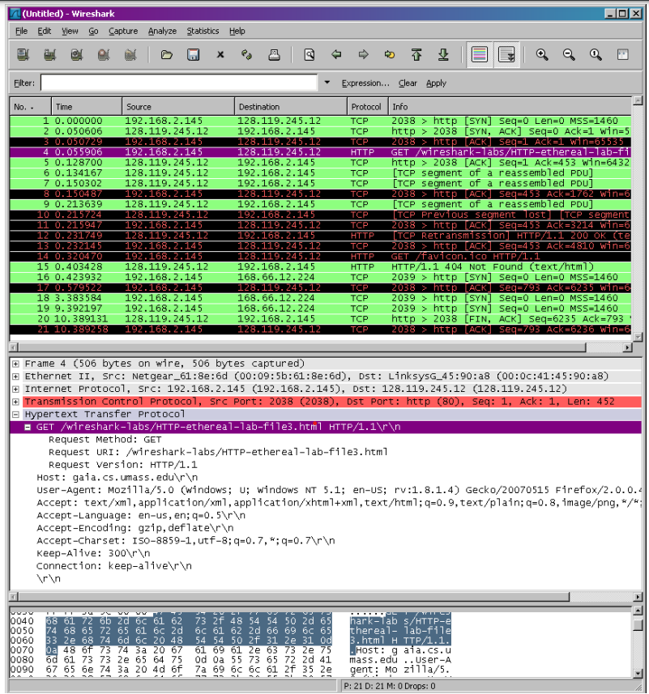

# Lab 9

Neste laboratório, exploraremos os protocolos Ethernet e ARP.

## Capturando e analisando quadros Ethernet

Vamos começar a captura de quadros Ethernet para executar a nossa atividade. Para tanto, faça o seguinte [^1]: 

- Primeiro, certifique-se de que o cache do seu navegador esteja vazio. Pesquise como fazer isso no navegador da sua preferência e em seguida inicie o Wireshark.
- Acesse o endereço <http://gaia.cs.umass.edu/wireshark-labs/HTTP-ethereal-lab-file3.html>. Será exibida a Declaração de Direitos dos EUA (um texto bastante longo).
- Pare a captura de pacotes no Wireshark. Primeiramente, encontre o número dos pacotes (coluna mais à esquerda na janela mais acima do Wireshark) da mensagem HTTP GET que você enviou do seu computador para gaia.cs.umass.edu, bem como o início da mensagem HTTP de resposta enviada de volta para o seu computador. Você verá uma tela semelhante a exibida a seguir (onde o pacote 4 contém a mensagem HTTP GET). 

Como este laboratório é sobre Ethernet e ARP, não estamos interessados em IP ou protocolos de camada superior. Então vamos mudar a janela de “listagem de pacotes capturados” do Wireshark para que ela mostre informações apenas sobre protocolos abaixo do IP. Para que o Wireshark faça isso, selecione Analyze->Enabled Protocols. Em seguida, desmarque a caixa IP e selecione OK. Agora você deve ver uma janela do Wireshark que se parece com:

Para responder às perguntas a seguir, você precisará examinar os detalhes do pacote e as janelas de conteúdo do pacote (as janelas de exibição intermediária e inferior no Wireshark).

Selecione o quadro Ethernet que contém a mensagem HTTP GET. (Lembre-se de que a mensagem HTTP GET é transportada dentro de um segmento TCP, que é transportado dentro de um datagrama IP, que é transportado dentro de um quadro Ethernet). Expanda as informações de Ethernet II na janela de detalhes do pacote. Observe que o conteúdo do quadro Ethernet (cabeçalho e carga útil) é exibido na janela de conteúdo do pacote.

Responda às perguntas a seguir com base no conteúdo do quadro Ethernet que contém a mensagem HTTP GET. Sempre que possível, ao responder a uma pergunta, você deve entregar uma impressão do(s) pacote(s) que você usou para responder à pergunta feita. Anote a impressão para explicar sua resposta. Para imprimir um pacote, use Arquivo->Imprimir, escolha Somente pacote selecionado, escolha Linha de resumo do pacote e selecione a quantidade mínima de detalhes do pacote que você precisa para responder à pergunta.

1. Qual é o endereço Ethernet de 48 bits do seu computador?
2. Qual é o endereço de destino de 48 bits no quadro Ethernet? Este é o endereço Ethernet de gaia.cs.umass.edu? (Dica: a resposta é não). Qual dispositivo tem isso como endereço Ethernet?
3. Forneça o valor hexadecimal para o campo de tipo de quadro de dois bytes. A qual protocolo da camada superior isso corresponde?
4. Quantos bytes desde o início do quadro Ethernet o ASCII “G” em “GET” aparece no quadro Ethernet?

Em seguida, responda às perguntas a seguir, com base no conteúdo do quadro Ethernet que contém o primeiro byte da mensagem de resposta HTTP.

5. Qual é o valor do endereço de origem Ethernet? Este é o endereço do seu computador ou de gaia.cs.umass.edu (Dica: a resposta é não). Qual dispositivo tem isso como endereço Ethernet?
6. Qual é o endereço de destino no quadro Ethernet? Este é o endereço Ethernet do seu computador?
7. Forneça o valor hexadecimal para o campo de tipo de quadro de dois bytes. A qual protocolo da camada superior isso corresponde?
8. Quantos bytes desde o início do quadro Ethernet o ASCII “O” em “OK” (ou seja, o código de resposta HTTP) aparece no quadro Ethernet?

## O protocolo ARP

Nesta seção, vamos observar o protocolo ARP em ação.

### ARP Caching

Lembre-se de que o protocolo ARP normalmente mantém um cache de pares de conversão de endereços IP para Ethernet em seu computador. O comando arp (tanto no MSDOS quanto no Linux/Unix) é usado para visualizar e manipular o conteúdo desse cache. Como o comando arp e o protocolo ARP têm o mesmo nome, é fácil confundi-los. Mas lembre-se de que eles são diferentes - o comando arp é usado para visualizar e manipular o conteúdo do cache ARP, enquanto o protocolo ARP define o formato e o significado das mensagens enviadas e recebidas e define as ações tomadas na transmissão e recebimento de mensagens.

Vamos dar uma olhada no conteúdo do cache ARP em seu computador:

- MS-DOS. O comando arp está em c:\windows\system32, então digite “arp” ou “c:\windows\system32\arp” na linha de comando do MS-DOS (sem as aspas).
- Linux/Unix/MacOS. O executável do comando arp pode estar em vários lugares. Locais populares são /sbin/arp (para linux) e /usr/etc/arp (para algumas variantes do Unix).

O comando arp do Windows sem argumentos exibirá o conteúdo do cache ARP em seu computador. Execute o comando arp. 

9. Anote o conteúdo do cache ARP do seu computador. Qual é o significado de cada valor de coluna?

Para observar seu computador enviando e recebendo mensagens ARP, precisaremos limpar o cache ARP, caso contrário, seu computador provavelmente encontrará um par de tradução de endereço IP-Ethernet necessário em seu cache e, consequentemente, não precisará enviar uma mensagem ARP.

- MS-DOS. O comando arp –d * do MS-DOS limpará seu cache ARP. O sinalizador –d indica uma operação de exclusão e o * é o curinga que diz para excluir todas as entradas da tabela.
- Linux/Unix/MacOS. O arp –d * limpará seu cache ARP. Para executar este comando, você precisará de privilégios de root. Se você não tem privilégios de root e não pode executar o Wireshark em uma máquina Windows, você pode pular a parte de coleta de rastreamento deste laboratório e apenas usar o rastreamento discutido na nota de rodapé anterior.

### Observando o ARP em ação 

Faça o seguinte (caso não tenha baixado o arquivo .zip da nota de rodapé): 

- Limpe seu cache ARP, conforme descrito acima.
- Em seguida, verifique se o cache do navegador está vazio.
- Inicie o sniffer de pacote Wireshark • Digite o seguinte URL em seu navegador <http://gaia.cs.umass.edu/wireshark-labs/HTTP-wireshark-lab-file3.html>. Seu navegador deve exibir novamente a longa Declaração de Direitos dos EUA. 
- Interrompa a captura de pacotes do Wireshark. Novamente, não estamos interessados em IP ou protocolos de camada superior, portanto, altere a janela "listagem de pacotes capturados" do Wireshark para que mostre informações apenas sobre protocolos abaixo do IP. Para que o Wireshark faça isso, selecione Analyze->Enabled Protocols. Em seguida, desmarque a caixa IP e selecione OK. 

Agora você deve ver uma janela do Wireshark que se parece com:

No exemplo acima, os dois primeiros quadros no rastreamento contêm mensagens ARP (assim como a 6ª mensagem). A captura de tela acima corresponde ao traço referenciado na nota de rodapé 1. 

Responda às seguintes perguntas:

10. Quais são os valores hexadecimais para os endereços de origem e destino no quadro Ethernet que contém a mensagem de solicitação ARP? 
11. Forneça o valor hexadecimal para o campo do tipo Quadro Ethernet de dois bytes. A qual protocolo da camada superior isso corresponde? 
12. Baixe a especificação ARP em <ftp://ftp.rfc-editor.org/in-notes/std/std37.txt>. Uma discussão legível e detalhada do ARP também está em <http://www.erg.abdn.ac.uk/users/gorry/course/inet-pages/arp.html>. 
a. Quantos bytes desde o início do quadro Ethernet o campo ARP opcode começa? 
b. Qual é o valor do campo opcode dentro da parte ARP-payload do quadro Ethernet no qual uma solicitação ARP é feita? 
c. A mensagem ARP contém o endereço IP do remetente?
d. Onde na solicitação ARP aparece a “pergunta” – o endereço Ethernet da máquina cujo endereço IP correspondente está sendo consultado?
13. Agora encontre a resposta ARP que foi enviada em resposta à solicitação ARP. 
a. Quantos bytes desde o início do quadro Ethernet o campo ARP opcode começa? 
b. Qual é o valor do campo opcode dentro da parte ARP-payload do quadro Ethernet no qual uma resposta ARP é feita? 
c. Onde na mensagem ARP aparece a “resposta” à solicitação ARP anterior – o endereço IP da máquina que possui o endereço Ethernet cujo endereço IP correspondente está sendo consultado? 
14. Quais são os valores hexadecimais para os endereços de origem e destino no quadro Ethernet que contém a mensagem de resposta ARP? 
15. Abra o arquivo de rastreio ethernet-ethereal-trace-1 em <http://gaia.cs.umass.edu/wireshark-labs/wireshark-traces.zip>. O primeiro e o segundo pacotes ARP neste rastreamento correspondem a uma solicitação ARP enviada pelo computador executando o Wireshark e a resposta ARP enviada ao computador executando o Wireshark pelo computador com o endereço Ethernet solicitado pelo ARP. Mas ainda há outro computador nesta rede, conforme indicado pelo pacote 6 – outra solicitação ARP. Por que não há resposta ARP (enviada em resposta à solicitação ARP no pacote 6) no rastreamento de pacote?

[^1]: Se você não conseguir executar o Wireshark ao vivo em um computador, faça o download do arquivo zip <http://gaia.cs.umass.edu/wireshark-labs/wireshark-traces.zip> e extraia o arquivo ethernet--ethereal-trace-1. Os traços neste arquivo zip foram coletados pelo Wireshark rodando em um dos computadores do autor, durante a execução das etapas indicadas no laboratório Wireshark. Depois de baixar o rastreamento, você pode carregá-lo no Wireshark e visualizar o rastreamento usando o menu suspenso Arquivo, escolhendo Abrir e, em seguida, selecionando o arquivo de rastreamento ethernet--ethereal-trace-1. Você pode usar esse arquivo de rastreamento para responder às perguntas abaixo.
